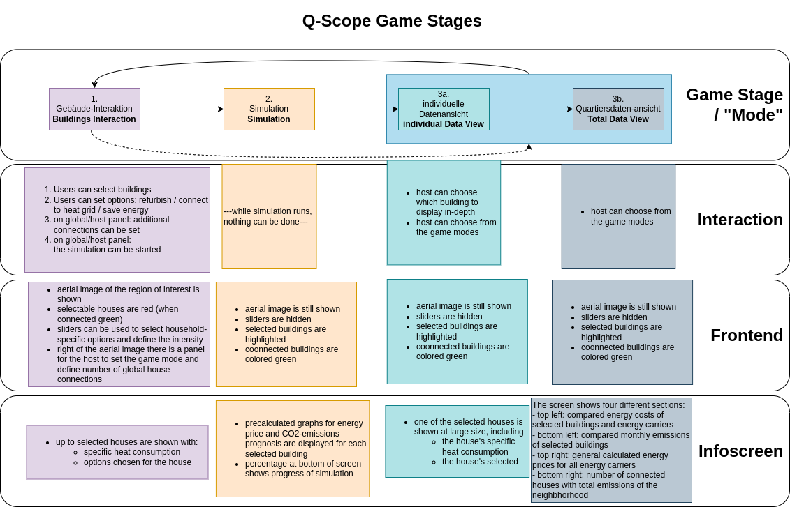
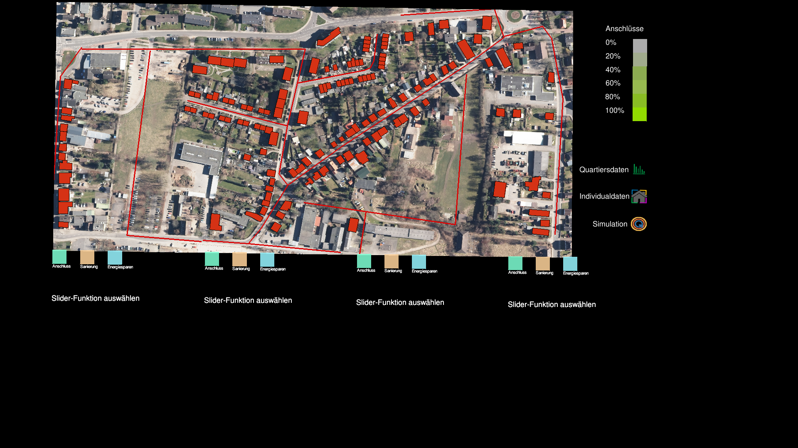

.. _frontend_mode:
.. _mode:

Game Modes
**********

All game-specific surfaces (a.k.a. "Game Modes") are stored in the folder ``q100viz/interaction``. Each game mode is represented as a custom class with similar generic functions. Each class is initiated to an object in :ref:`session.py<session>` to be able to globally access it.

* In the :ref:`QUARREE100 use case<quarree>` there are different machine states, defined by the files in ``q100viz/interaction/`` → these are the modes the program is running at (per time)
* implemented modes are:
    * :ref:`Interaction <buildings_interaction>`
    * :ref:`Simulation <simulation_mode>`
    * :ref:`Data View <data_view>`
    * (:ref:`Calibration<frontend_calibration>` - for Debugging)

.. _game_iterations:

After each simulation, a new "Game Iteration" or "Round" is started (which will also be indicated on the :ref:`infoscreen<infoscreen_buildings_interaction>`). Each Round has its own data output and data of different rounds are exported to the same graphs for comparison. This way, users can compare the results of different (refurbishment/heat grid connection/energy-saving) actions.

Game Mode Generic Functions
===========================

* The ``__init__`` function is seldomly used, since it will be run in the beginning of the script (in ``session.py``), before the variables (e.g. ``grid``) are initialized.
* The ``activate`` function is called automatically in the game loop, when `session.active_mode` changes to this object in the :ref:`game loop <frontend_game_loop>`. **It should not be called manually!**. This function can be used to define which graphical parts shall be displayed, by setting ``session.show_polygons`` etc to true or false. The same can be done for each slider individually.
* ``process_event`` is a function that takes care of mouse events (for debugging purposes, it is possible to select and alter the buildings via mouse L/M/R clicks).
* ``process_grid_change`` is the most important function in each of the game mode classes, as it takes care of the interaction possibilities: It is called each time a :ref:`grid change<read_scanner_data>` is received from cspy. See the :ref:`buildings interaction mode<buildings_interaction>` code as an example.

Some cells can be programmed to trigger additional events, like leaving the current game mode. This is done via tables in ``q100viz/settings/``. Read more on how to program link functions to cells :ref:`here<programming_cell_functions>`.

.. hint::

  For debugging purposes, the Game Modes can be switched using input keys:

  - ``3`` activates the :ref:`Buildings Interaction<buildings_interaction>`
  - ``4`` starts the simulation
  - ``5`` enters the :ref:`individual data view<individual_data_view>`
  - ``6`` enters the :ref:`total (neighborhood) data view<total_data_view>`
  - ``C`` starts the :ref:`Calibration Mode<frontend_calibration>`

.. _buildings_interaction:

1. Buildings Interaction Mode
=============================
In the Input Mode, users can set household-, buildings- global parameters. They can leave the mode placing a token on the "simulation mode" selector.

Buildings Interaction
---------------------

The ``process_grid_change`` function of this mode make sure that, after each incoming grid change, the whole grid is iterated using the following routine:

  #. check for intersections with selected (non-white) cells and polygons
  #. according to the rotation of the cell, set the selection of an overlapping building to true and set its ``cell`` value to the ID of the cell. (IDs of the building will later be used for the grouping of buildings - and to allocate them to the users)
  #. for slider handles: update the selected feature of the building with the current slider value
  #. for mode selectors: enable countdown timer for next mode to start
  #. for global/scenario handles: connect additional buildings to the heat grid. There is a dedicated dataframe for these additionally selected buildings called ``session.scenario_selected_buildings`` that excludes all user-selected buildings, so they can be specifically referred to. These buildings will be set 'selected'.
  #. Finally, environment- and buildings-information will be :ref:`sent via UDP to the infoscreen<frontend_UDP_send>`.

Buildings Mode Display
----------------------

The Buildings Interaction Mode is the most feature-rich display. It shows the basemap with buildings polygons and the heat grid on top. Selected buildings are highlighted by the user-specific color (according to the :ref:`ID<programming_tangibles>` of the token used for selection). On the right, there is a global section containing some functional cells to force-connect a selectable number of buildings to the heat grid.
It contains interaction possibilites for the change of the game modes and sliders for individual setting of the buildings' decision features.

.. _simulation_mode:

2. Simulation
=============

The "Simulation Mode" is the second mode to be run, once all users have selected and specified their households. In this mode, the frontend will start :ref:`GAMA<installing_gama>` in headless mode (no GUI) a subprocess to run the agent-based-model. The users will have to wait until the simulation finished, and the only thing the frontend does is forwarding status information via UDP from GAMA to the infoscreen.

The Simulation can be started by either placing a token on the specified cell on the right side of the frontend (or using the ``S`` key). It will generate an experiment API file for GAMA according to this scheme: https://gama-platform.org/wiki/Headless#simulation-output and run the provided model file using the ``gama-headless.sh``. These two files are to be set up in ``config.py``:

.. code-block:: python
  :caption: config.py

  'GAMA_HEADLESS_FOLDER' : '/home/qscope/GAMA/headless/',
  'GAMA_MODEL_FILE' : '../q100_abm/q100/models/qscope_ABM.gaml',

**ATTENTION**: make sure to set the user rights of ``gama-headless.sh`` executable via ``chmod u+x gama-headless.sh``

.. _simulation_setup:

Setting up the simulation
-------------------------

Upon initialization of this game stage, a new thread is started for the gama simulation to run (later), so the rendering of the pygame canvas will not be stopped when the subprocess begins.

In order to start the simulation, it first has to be set up, using the ``simulation.setup()`` function. Only after that it can be started by setting ``session.active_mode = simulation``.

The function accepts the following **Input Parameters**:
* ``input_max_year`` (int): until which year should the simulation run? providing "2045" will make the simulation run up until 2044-12-31.
* ``export_neighborhood_graphs`` (bool) disable export of individual graphs, for debugging purposes

The **simulation setup algorithm** logs the simulation start time and defines the output path to export the results in the following manner:

**1.** A new output folder is created for the current :ref:`game iteration round<game_iterations>` using the current OS time: ``qScope/data/outputs/output_YYYYmmdd_HH_MM_SS``

.. code-block::
  :caption: tree view of output folder

    project qScope
    └───data
        └───outputs
            └───output_YYYYmmdd_HH-MM-SS
            |   └───connections
            |   └───emissions
            |   └───energy_prices
            |   └───snapshot
            └───buildings_clusters_YYYYmmdd_HH-MM-SS.csv
            └───buildings_power_suppliers.csv
            └───console-outputs-null.txt
            └───simulation_parameters_YYYYmmdd_HH-MM-SS.xml
            └───simulation_outputsnull.xml

Read more about the simulation results in the :ref:`ABM section<simulation_outputs>`.

**2.** An xml file necessary to start the simulation in headless mode is created from the ``session.environment`` parameters. Here we store initial values for certain variables in GAMA. These parameters are:

   * Alpha scenario
   * Carbon price scenario
   * Energy prices scenario
   * Q100 OpEx prices scenario
   * Q100 CapEx prices scenario
   * Q100 Emissions scenario
   * Q100 Emissions scenario
   * Carbon price for households?

The xml struct is created in a function called ``make_xml`` and saved in the output folder using the time stamp of the simulation start. ``simulation_parameters_YYYYmmdd_HH-MM-SS.xml``

A set of different scenarios can be found in the ``data/scenarios`` folder in the form of .csv files. These all regard different energy price scenarios under which the model can be investigated.

In short, the **Input Data** for the simulations in QUARREE100 are defined in the ``qScope/data/`` folder via the files ``scenario_X.csv``. Which one of these files is taken, will be defined in ``session.py`` in the ``environment['active_scenario_handle']`` entry. The file this entry points to, will be read in ``simulation.setup()``, and transfered to an xml file to eventually set the simulation's input data accordingly.

.. csv-table:: example of a simulation scenario to serve as input data for GAMA variables.
  :widths: 20, 15, 20, 30, 20
  :header: name,type,value,name_human_readable,value_human_readable

  alpha_scenario,string,Dynamic_moderate,Anteil monatlicher Energieausgaben am Haushaltsbudget,Moderat ansteigend (ca. 7 - 10 %)
  carbon_price_scenario,string,B - Moderate,CO2-Bepreisung,Moderat ansteigend (ca. 25 - 350 € / Tonne CO2)
  energy_price_scenario,string,Prices_2022 1st half,Energiepreisentwicklung (ohne politische Maßnahmen), Preisentwicklung 2022
  q100_price_opex_scenario,string,12 ct / kWh (static),Q100-Wärmeversorgung: Betriebskosten, Dauerhaft 12 ct / kWh
  q100_price_capex_scenario,string,5 payments,Q100-Wärmeversorgung: Investitionskosten,Ratenzahlung (5 x 1000 €)
  q100_emissions_scenario,string,Declining_Linear,Q100-Wärmeversorgung: Emissionsverlauf, Jährlich abnehmend (100 - 0 g / kWh)

.. note::
  For debugging purposes, some random N buildings can be marked as selected and force-connected to the heat grid for the simulation by starting the frontend script with the input flag ``--select_random N`` (int). :ref:`See more about the frontend startup flags here<frontend_startup_flags>`.

**3.** After setting up the simulation input data, ``simulation.running`` will be set ``True``, which causes the simulation to actually be executed (once) in the dedicated thread via ``run_script()`` within ``simulation.run()``. The process of the latter function will sty on hold until the subprocess is done.

**4.** Once the subprocess is done, :ref:`matplotlib graphs are created<graphs>` from the output data and the paths of these files will be send via UDP to the infoscreen to be displayed there in the next game stage.  Some historic data will be added to these graphs for comparison. Pre-calculated data, created using one of the :ref:`auxiliary scripts<interactive_programming>`, can be added for comparison.

Simulation Mode View
--------------------

There is no possibility for user interaction in this mode. The frontend only forwards information on the in simulation process in percent to the infoscreen, where that number is displayed.

.. _data_view:
.. _individual_data_view:

3a. Individual Data View
========================

This game stage is used to focus on single selected buildings and show the created graphs on heat consumption, CO2-emission and energy costs of that building :ref:`on the infoscreen<infoscreen_individual_data_view>`.

The interaction surface is constrained to the :ref:`mode selectors<modeselector>` and to four cells highlighted in the colors of the users - these can be used to focus on the building of the according user. The general basemap can not be used for interaction.

.. _total_data_view:

3b. Total Data View
===================

The total data view mode is used to :ref:`display all neighborhood data on the infoscreen<infoscreen_individual_data_view>` displaying charts that compare the selected houses energy costs and emissions, as well as the overall energy cost development and the total amount of buildings connected to the heat grid.

All possible interaction is constrained to the :ref:`game mode selectors<modeselector>`.
