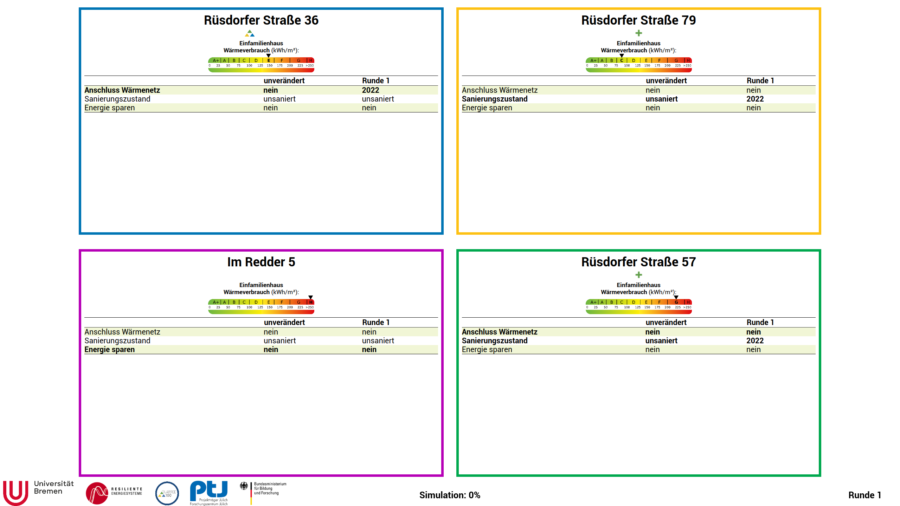
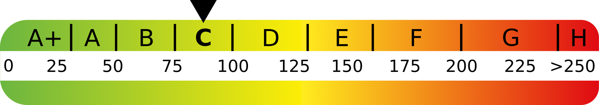
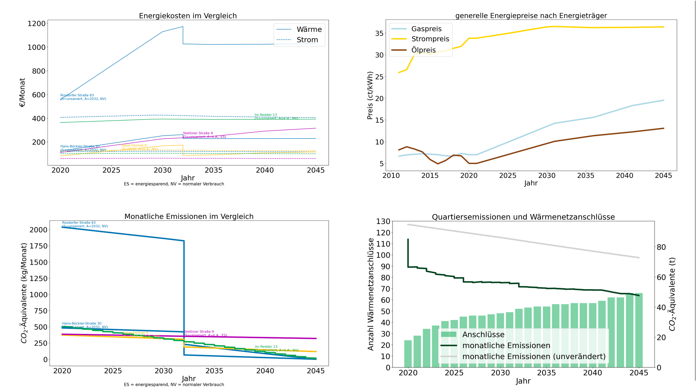

.. _infoscreen:

Infoscreen
##########

.. toctree::
   :maxdepth: 2
   :caption: API

   API/frontend_API
   API/infoscreen_API.rst
   API/tag_decoder_API.rst
   
Overview
***********************

Infoscreen is primarily a node js application. q100_info.js runs a web application using expressjs, and communicate with Q-Scope Frontend via UDP messaging using socket.io. Rendering of views are done with html+css+javascript at public folder.

js/main.js receives UDP message from the frontend, and injects data and renders :ref:`respective views<infoscreen_views>`.

.. _installing_infoscreen:

Infoscreen Installation
=======================

Clone the repository to local:

..  code-block:: bash

    git clone git@github.com:quarree100/qScope_infoscreen.git``

Install node modules:

..  code-block:: bash

    cd qScope_infoscreen
    npm install

Setup a folder public/data as a symlink pointing to qScope/data:

..  code-block:: bash

    ln -s ../data/ ./public

File Structure
=========================

..  code-block::

    project qScope
    └───cspy
    └───data
    └───q100_abm
    └───qScope_frontend
    └───qScope_infoscreen
        └───node_modules
        └───public
            └───data #symlink to qScope/data
            └───img
            └───js #pure js files
            └───lib #js libraries such as jquery and socket.io
            index.html
            style.css
        q100_info.js
            nodejs file

Run the infoscreen
=========================

Run npm shortcut command:

..  code-block:: bash

    npm start #equivalent to ``npm run start``, which is defined in package.json. "start" script runs ``npx nodemon q100_info.js``

.. _infoscreen_views:

Modes/Views
****************************

.. _infoscreen_buildings_interaction:

Buildings Interaction View
===========================

Tiles of information card shows the information of 4 different selected buildings.
In each tile, at the top the name of the building is stated. Under it three icons indicate the options that user selected for the current round, which itself is shown in the lower right corner.

|icon_heat_grid| the connection to the heat grid

|icon_green_plus| refurbishment status

|icon_save_energy| energy consumption preference.

The Heat consuption is indicated in a chart in 9 scale from A+ to H.

In the table these three options are displayed throughout rounds.

.. _infoscreen_inidividual_data_view:

Individual Data View
=========================

.. image:: img/Infoscreen_03a_individualDataView.png
    :align: center
    :alt: [close-up of a green square showing information of one of the selected houses and two graphs with predicted CO2-emissions and energy costs up until the year 2045.]

The individual data view displays the information of one selected building. In addition to the information in the buildings interaction view, emissions over time and energy costs per household over time are shown in charts.

.. _infoscreen_individual_data_view:

Total Data View
=========================

There are four different graphs to show the result of the simulation.

1. Energiekosten im Vergleich / Energy costs in comparison
shows the change of the energy cost over time per building.

2. Generalle Energiepreise nach Energietraeger / General energy prices by energy carrier
shows the change of price of energy prices per energy carrier.

3. Montaliche Emissionen im Vergleich / Montaliche emissions comparison
shows the change of monthly CO2 emissions over time per building.

4. Quartiersemissionen und Waermenetzanschluesse / Neighborhood emissions and heating network connections
shows the CO2 emissions of the whole neighborhood over time and the number of the connections to the heat grid over time.

Developemnt tools
*****************

Developemnt tools (js/devTools.js) provides useful function for debugging.

* ``Space bar``: switch modes
* ``D``: show data view mode
* ``V``: show verbose (lines around html elements)
* ``T``: inject extra round data (a column will be added in the round information table)
* ``I``: inject sample data

Known Errors
************

``[nodemon] Internal watch failed: ENOSPC: System limit for number of file watchers reached, watch '/home/user/github/qScope/qScope_infoscreen/public/data/outputs/output_20221111_11-51-29/energy_prices/energy_prices_4.09.csv'`` can be fixed either by restarting the computer or by `increasing the system limit for number of file watchers <https://stackoverflow.com/questions/65300153/error-enospc-system-limit-for-number-of-file-watchers-reached-angular>`_.