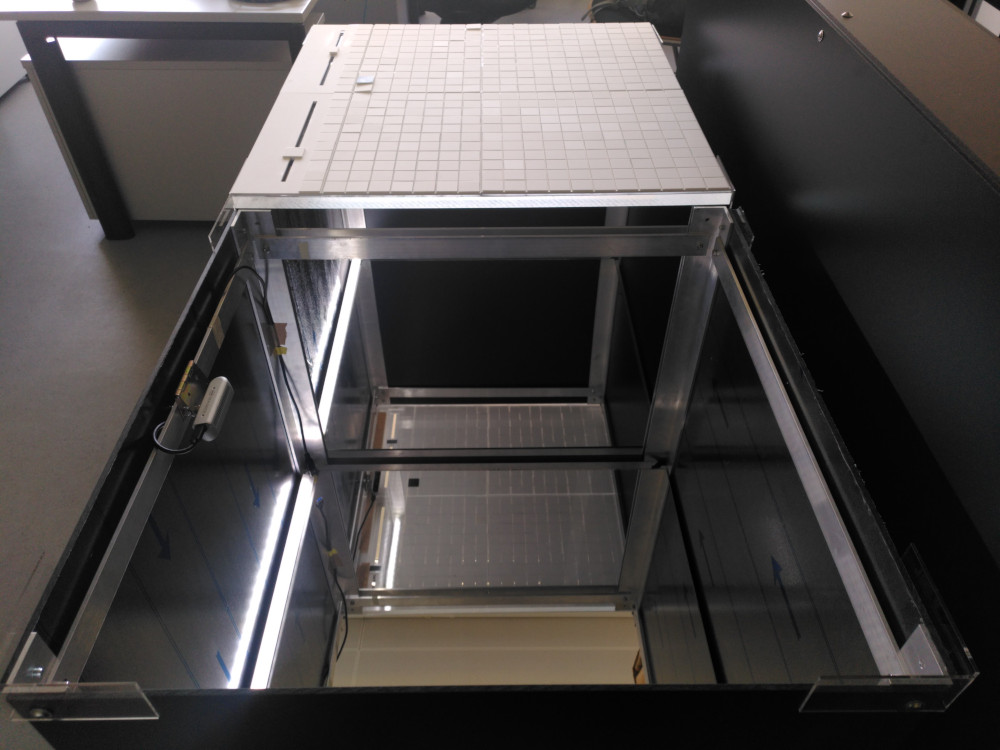

Quick Setup Manual
##################

This manual is meant as a handout and briefly describes the single steps needed to set up the Q-Scope for exhibition.

1. Strom anschalten
2. Zügig Monitor + Projektor anschalten, da sonst Frontend auf Monitor startet..
3. Kalibrierung cpsy:
   -

Starting the software
*********************

You'll need Python to start the **frontend**. The frontend will be started by navigating to the  project folder and do ``python3 run_q100viz.py``. A window will open and show the contents that will be projected onto the table. This is the frontend the users can see and interact with:

.. image:: img/frontend_full.png
    :align: center
    :width: 600
    :alt: You should see an image of the frontend here. It is basically a black canvas with a map on it and some buttons on the side.

You see a lot of the black canvas around a slightly distorted map. This is due to the "keystoning", the adjustment of the image for the angles the projector produces with respect to the table. By casting an appropriately distorted image onto the table, the distortion will even out, geometrically. ✨

Now we want to interact with the things we see on the canvas - the buttons, the sliders and the map. For this, we'll need cspy, which serves as the **backend**, decoding the configuration of tangibles on the table.
Start the script for each table individually by navigating to the cspy folders and do ``python3 run_keystone.py [path/to/settings/file.json]``, indicating which :ref:`calibration settings file<cspy_calibration>` to use. A window will show up to define the Region of Interest and do the :ref:`keystone calibration<frontend_calibration>`. After doing this once, the adjustment will be saved and this step can be skipped next time.
The scanning will be started with ``python3 run_scanner.py [path/to/settings/file.json]``. The decoder will send interaction data now to the frontend script, which will react by altering the projection.

In order for the **infoscreen** to receive and process information, it has to be started by executing ``npm start`` or ``node q100_info.js`` in the q100_info folder.

You can start each program individually, but be aware that, for the handshake between the programs to succeed, it is recommended to follow certain order:

.. code-block::

    cd path/to/cspy
    python3 run_scanner.py settings/qscope_L.json &
    python3 run_scanner.py settings/qscope_R.json

    cd path/to/qScope_infoscreen &
    node q100_info.js

    cd path/to/qScope_frontend &
    python3 run_q100viz.py

There is a start script ``/home/qscope/start.sh`` on the Q-Scope computer that will run automatically upon startup (see below). The script _frontend_startup_flags all application in the necessary order. In order to stop all the processes, ``/home/qscope/stop.sh`` can be executed.

.. _setup_instructions:

Hardware Setup Instructions
***************************

**1.** Place the tables in front of the unit with the Infoscreen and projector (fine-tuning will be done later)

**2.** put mirrors into the table, connect the cameras usb cables to the computer.

**3.** there is one led strip inside each of the tables at the side of the webcam.

.. image:: img/assembly-00.jpg
    :align: center
    :alt: image of tables with webcam pointing downwards onto mirrors

**4.** make sure the camera captures the whole mirror. You can use the :ref:`realsense-viewer<realsense>` application for this. **Note: make sure the USB 3 connection is established. If only USB type 2 is detected, unplug the cameras and try another time!**

**5.** Put the heavy acrylic glass on top. These have some tape on the bottom side that was used to cover some light reflection. These tapes indicate, whether it is the left or the right table, by showing an 'L' or an 'R', respectively.

**6.** Put the acrylic grid and the sliders on top: The sliders are marked with a little number on the bottom side, since (as of today) they are slightly different and need :ref:`specific positioning relative to the cameras <frontend_slider_setup>`. Numbering goes from left to right (0 to 3)

.. image:: img/assembly-02.jpg
    :align: center
    :alt: image of bottom side of slider with a little "0" at the bottom left

**7.** now conduct the :ref:`cspy calibration<cspy_calibration>`:

#. (first stop all running programs using ``stop.sh``)
#. go to the cspy folder and ``python3 run_keystone.py settings/qscope_L.json`` (do the same with ``settings/qscope_R.json``)
#. conduct rough keystoning by positioning the corner points roughly in this order: up right, up left, bottom right, bottom left.
#. execute ``python3 run_scanner.py settings/qscope_L.json`` (do the same with ``settings/qscope_R.json``) and fine-tune the positioning of the corner points using TAB and WASD keys. Press ``k`` to save.
#. Conduct the :ref:`calibration of the detection<cspy_detection_settings>` algorithm according to the light conditions.

.. image:: img/cspy_all_windows.png
    :align: center
    :alt: Ideal calibration situation with three windows showing the original RGB webcam stream, the resulting image after brightness and threshold adjustments, and a greyscale overlay to even out uneven light distribution.

In an ideal calibration (like in the image above), the **binary image** should show the tags' black quarters as perfect white squares. No light should leak through the grid.

**8. Projection keystoning:** start the frontend projection via ``cd path/to/frontend && python3 run_q100viz.py``. Enter the keystone-calibration by pressing ``c``, put the viewports corners right on the tables edges, until no light leaks to the floor. Also, enable grid view via ``c`` - if the frontend grid matches the physical grid. Move the physical grid slightly, if needed and possible. Things should line up more or less precisely now.

.. TODO: how to disassemble & transport
