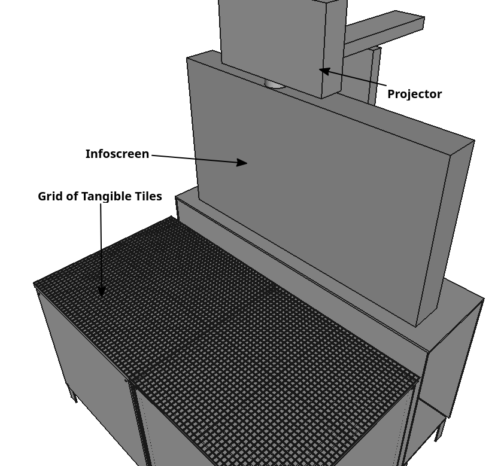
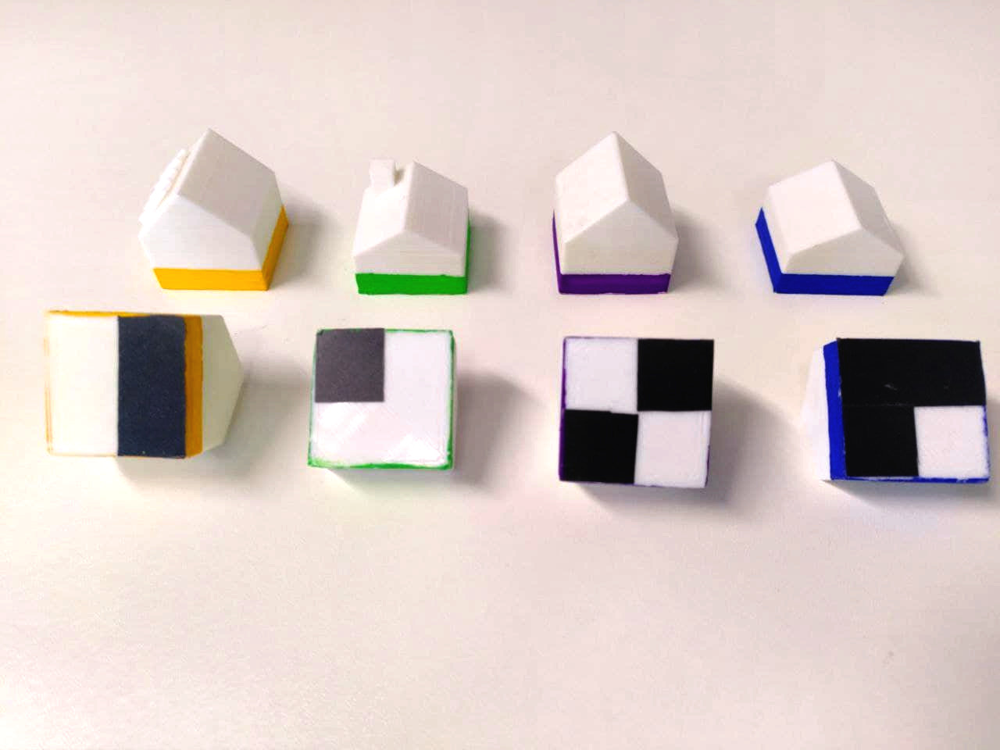
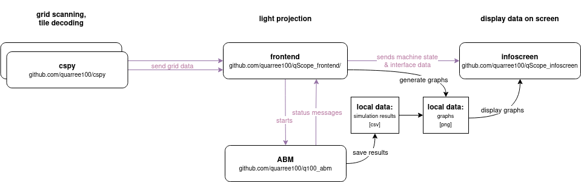

Physical Setup
##############

Starting from the beginning: This section will show you how the Q-Scope is built, both physically and its software.

Hardware Overview
*****************

The whole setup is made of two physical tables, with interactive components on top; two cameras sitting inside the tables; a projector casting an image onto the tables; and a TV screen to show additional information.
The table tops are of acrylic glass, on top of which there is a grid of tiles. Some of the tiles are tagged on the underside, so they can be decoded by the cameras from below. Each interaction with any of the tagged tiles will cause the projection and the infoscreen to respond in real time.
So the Q-Scope has to of each of the following instances:

- A physical table with a phyiscal grid on top
- A camera underneath, with software to decode the current arrangement of acrylic tiles
- A :ref:`frontend grid object<frontend_grid>` that receives messages from the according tag decoder and translates them into commands for the projection.

This way, the whole framework is always in-sync, and users can interact *with the surface projection* by exchanging tiles on the tables.

In the image above you see four groups of :ref:`tangibles<programming_tangibles>` - objects with the same color (human-readable) share the same tag (machine-readable).

.. _realsense:

Cameras
=======

For our setup, we use `Intel realsense <https://www.intelrealsense.com>`_ cameras, but any webcam with a good resolution can be used; just take care, that the necessary ROI can be observed, which should be easily achievable pointing the cameras at the mirrors at the bottom of the tables (instead of pointing the cameras directly at the table top).

For debugging realsense cameras, the `realsense-viewer` is a tool that comes with librealsense and can be run from a terminal. Make sure that the USB 3 connection is well established - otherwise a FullHD stream cannot be achieved!

You'll first need to install librealsense as described on `their GitHub Repository <https://github.com/IntelRealSense/librealsense#download-and-install>`. Additionally for cspy to be able to use those cameras, you must install pyrealsense - a realsense python wrapper. (See its documentation here: `https://pyrealsense.readthedocs.io/en/master <https://pyrealsense.readthedocs.io/en/master>`_)

Software Overview
*****************

Each physical component of the setup has a piece of software it is linked with.
The image stream (camera) of the grid of tiles are scanned and decoded by :ref:`cspy<cspy>`. The software sends the grid information to the :ref:`frontend<frontend_usage>` (projector), which will cast an adjusted interface onto the table accordingly and send information about the machine state to the :ref:`infoscreen<infoscreen>` (TV) to display metadata. A GAMA Agent-Based-Model (:ref:`ABM<ABM>`) can be executed via interaction on the table. The data it outputs is stored locally and loaded by the infoscreen to display comprehensive graphs.

.. _architecture:

Framework Architecture
**********************

go to the repositories listed below and download them; I would recommend putting them all into one project folder like so:

.. code-block::

    project qScope
    └───cspy
    │   Token Tag Decoder (one instance for each left and right table)
    └───data
    └───q100_abm
    └───qScope_infoscreen
    │   infoscreen (NodeJS/ JavaScript)
    └───qScope_frontend
        projection (Python)

where:

* cspy: https://github.com/quarree100/cspy
* data: has to be linked from Seafile server as discussed :ref:`below <Data>`.
* GAMA: https://github.com/quarree100/q100_abm
* qScope_infoscreen: https://github.com/quarree100/qScope_infoscreen
* qScope_frontend: https://github.com/quarree100/qScope_frontend

Go directly to:

* :ref:`Installing the frontend<frontend_installation>`
* :ref:`Installing the decoder<installing_cspy>`
* :ref:`Installing the infoscreen<installing_infoscreen>`
* :ref:`Installing GAMA<installing_gama>`

.. _Data:

Data
****

Q-Scope relies on a local data folder with GIS information on the map, the polygons and data on the houses that shall be displayed. The folder contains Shapefiles used to display both an aerial photograph (raster file) and polygon information for each houses to be able to interact with - provided as Shapefiles. Some additional, household-specific data in the form of csv files are provided, which can be lined to the polygons.

.. TODO: provide simple working example data folder without sensitive data!