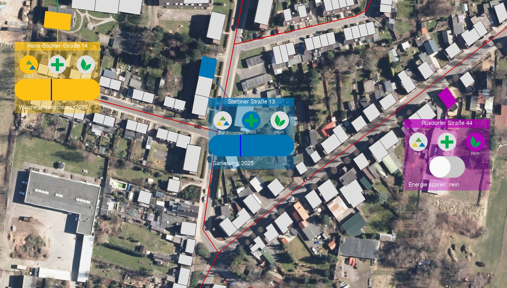

Touch Interaction Frontend
##########################

The interaction possibilities of the touch table are limited to simple mouse clicks, which means, only one user can interact with the interface at a time (there ain't no multi-mouse application). The :ref:`Tangible Version <q_scope_tangibles>` of the allows for multi-touch input via its `TUIO <https://tuio.org>`_-implementation.

Popups
******

The frontend now does not rely on the :ref:`grid<frontend_grid>` anymore. Instead, it brings up a new menu design using TouchEvents. These are collected in a new file in ``q100viz/interaction/PopupMenu.py``.

With a simple touch on one of the buildings, a popup menu appears. The user can use this to set the decision variables (heat grid connection, refurbishment, energy-saving behavior) for the building.
Machine states / Modes can be set accordingly, and a global number of heat-grid-connected buildings can be adjusted using TouchEvents, too.

SidePanel
*********

There is also a panel at the right side of the screen that handles the interaction modes and the global connections. This is new. In the previous version, a bottom bar was needed for sliders, which now is obsolete.