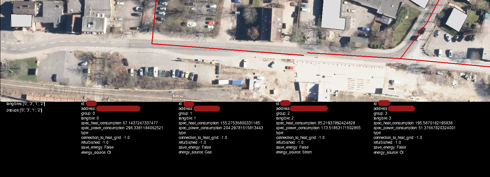

Development
###########

If you want to look under the hood of the software and get some more insights as an FGRes-Developer, there are several ways to get a closer look at the underlying data and code.

Verbose Mode
************

One simple way to understand what's going on inside of the Q-Scope framework is to activate the verbose mode. Do this by either starting the software by setting the flag -v upon startup ``(venv) python3 run_q100viz.py -v`` or by simply pressing ``v`` while the application is running (and the window is active).

.. hint:: There are more useful flags that can be set, as described in :ref:`Version 1 > Frontend > Run <frontend_startup_flags>`

When activating verbose mode, there will be an extra bar at the bottom side of the screen, indicating which tangibles are in use, which popups are active, and specific information about the selected buildings (that shall usually be hidden from the users).

Terminal Mode
*************

One more thorough way to manage and test the data is to interact with it using an interactive python shell directly. Jupyter Notebook is a good way to mess with the dataframes, but a simple terminal can be used as well.

.. code-block:: bash

    user@computer:~/qscope/qscope_frontend$ source qscope/bin/activate
    (qscope) user@computer:~/qscope/qscope_frontend$ python3
    Python 3.12.3 (main, Nov  6 2024, 18:32:19) [GCC 13.2.0] on linux
    Type "help", "copyright", "credits" or "license" for more information.
    >>> import q100viz.session as session
    pygame-ce 2.5.2 (SDL 2.30.8, Python 3.12.3)
    >>> data = session.buildings.df
    >>> data
            full_id  ...                                   target_point
    0    w167223973  ...    POINT (1577.1187744140625 307.555908203125)
    1    w167224003  ...   POINT (1456.5195703628178 961.7660319587545)
    2    w167224035  ...   POINT (1960.981364408923 448.98051396324274)
    3    w167224049  ...     POINT (1557.461918495714 410.200927637501)
    4    w167224056  ...  POINT (1396.4088283928777 311.11582422359606)
    ..          ...  ...                                            ...
    135  w398521186  ...  POINT (2029.7565564410634 224.48160037033577)
    136  w398521187  ...   POINT (1782.8624544774548 492.5126154058698)
    137  w398521188  ...   POINT (1715.0173478072866 508.4795814339026)
    138  w398521190  ...  POINT (1780.4670700626627 493.07635571747403)
    139  w398521191  ...  POINT (1873.6891809524182 471.13705381800895)

    [140 rows x 104 columns]

    >>> data.energy_source
    0      Strom
    1         Öl
    2        Gas
    3      Strom
    4      Strom
        ...  
    135      Gas
    136    Strom
    137       Öl
    138      Gas
    139       Öl
    Name: energy_source, Length: 140, dtype: object

Now you can use the python pandas module to get a proper insight on the data structures and test your algorithms, if necessary.