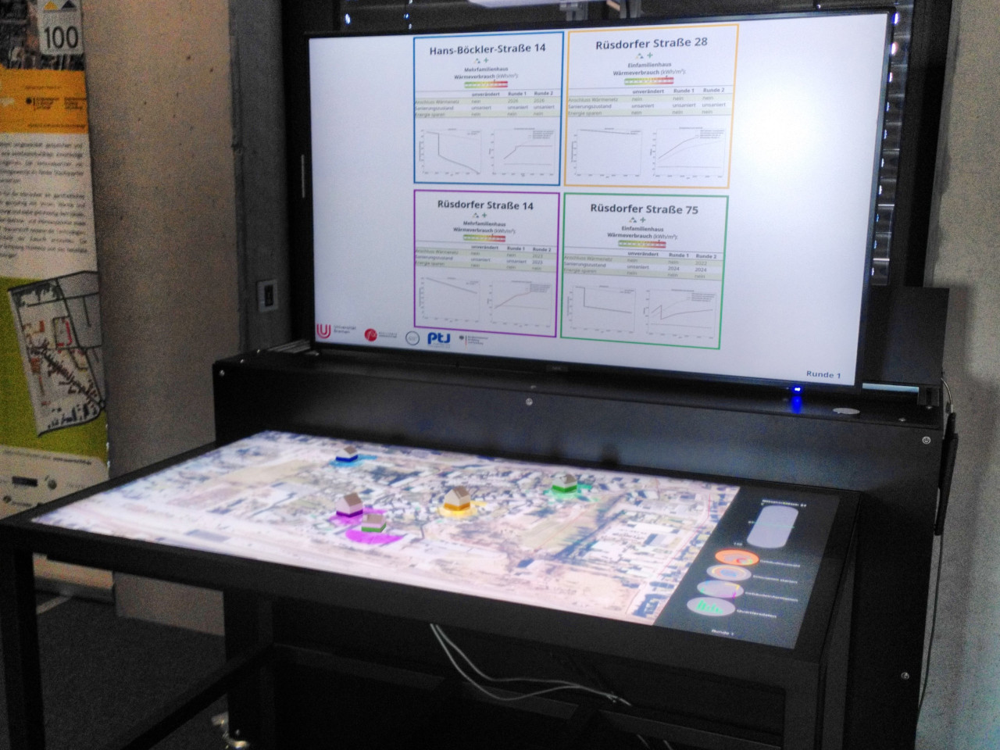

.. _q_scope_tangibles: 

Q-Scope Tangibles
#################

The third iteration of the Q-Scope makes use of the Tangible Objects that can be used on the Interactive Scape Touch Table. For communication between touch table and computer, the `TUIO protocol <https://tuio.org>`_ (1.0) is used.

The frontend code for the application using tangible objects is provided in the branch ``main_tangibles`` of the `project repository <https://github.com/quarree100/qScope_frontend>`_.

Installation
************

The Q-Scope Tangibles Software can be installed using the same :ref:`install script provided in Version 2<bundle-installation>`.

TUIO touch table setup
**********************

The Interactive Scape Touch Tables use the `TUIO protocol <https://tuio.org>`_. Any interaction with TouchEvents or Tangible operations are sent via UDP over Ethernet to the client.

**Setting up the Table:**

You'll have to connect the table to your computer via LAN and set the switch on the bottom of the table to "TUIO" so it uses the TUIO messaging protocol via UDP.
Your computer either needs a static IP in the scope of the table (10.42.0.x) or it has to be configured as DHCP server, which currently is the case.
The touch table's control interface can be reached via ``10.42.0.83`` (copy this url into your browser and you can configure your setup). Tell your table to send the messages to 10.42.0.1, for example, if this is the IP of the Q-Scope-Computer, and configure the :ref:`python config <frontend_config>` accordingly.

**Some useful tools for getting insights on your IP address and settings on Linux systems are:**

* ``nmap -sn 10.42.0.1/24`` to scan network for IPs
* ``sudo tcpdump -i eno1 udp`` to show incoming UDP messages 