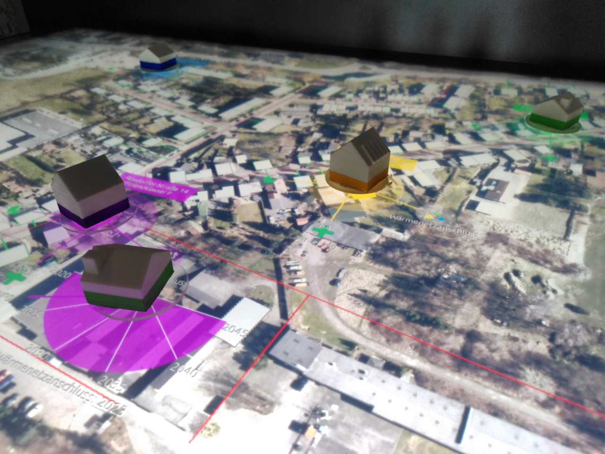
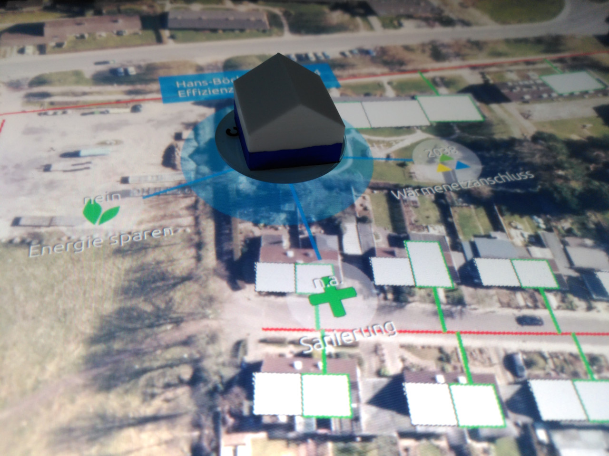
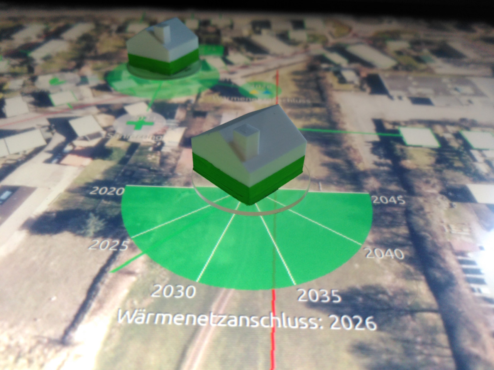

Q-Scope Tangibles: Frontend and Usage
*************************************

Any Interactive Scape Tangible can be used, the software cycles their IDs through the amount of users (which is pre-configured to be four - so there are four groups). You'll see which group your tangible is associated with by putting it onto the table: it will glow in the according color.

   
Each user needs two tangibles: one to select a building, and another one to tune the house's decision parameter (according to the :ref:`ABM <abm>`).

Once you place a tangible on an unoccupied house polygon, it will be selected and there will be three icons popping up for you to further process the houses decision-making-attributes.

With a second token you can further adjust the user's decisions regarding date of refurbishment, date of connection to the heat grid or simple energy saving:

