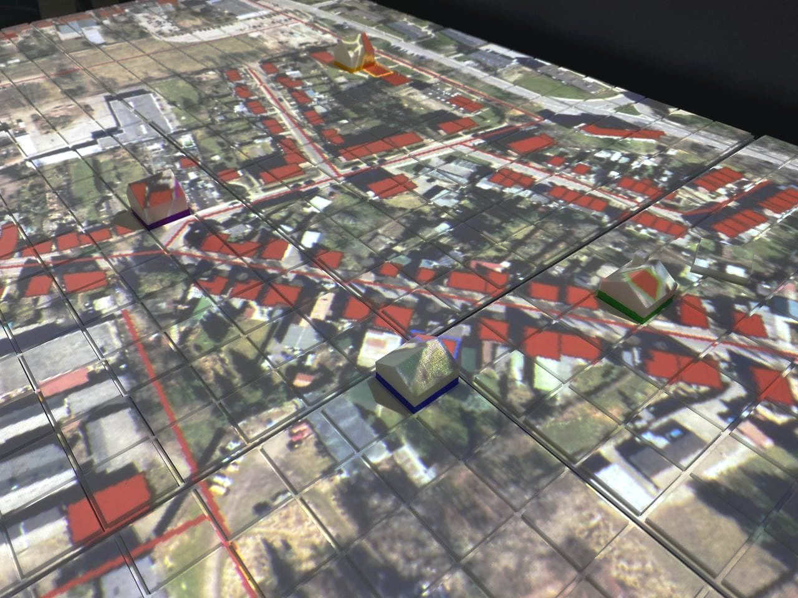

.. _quarree100:

QUARREE100
##########

Introduction
************

The Q-Scope framework was used in the `QUARREE100 <quarree100.de>`_ project. Before diving into the detailed programming of the framework, you should understand how we used it in the "pilot project" QUARREE100. This documentation will frequently refer to the setup we implemented for QUARREE100.

After startup, you see an aerial photograph of the area of importance for the QUARREE100 project, projected onto the table. All existing buildings are displayed, some marked red. These colored buildings are the ones you can interact with.
On the right side, there is an area for global settings, that is to be used only by the "game master" - a person that guides the whole group of users through the workshop. The area contains some positions to switch through the game modes and a range of fields for some gameplay scenarios.

For the general user interaction, all users get two tokens with which they can select buildings from the map. By placing one of their tokens onto one of the red houses, the users will be able to see the buildings' address and energy saving on the infoscreen.

.. image:: img/Infoscreen_01_buildingsInteraction.png
    :align: center
    :alt: [Image of the infoscreen, showing four colored squares, each of which contains the address of the selected houses. In each of the squares there is a table with information on energy saving measures.]

In the QUARREE100 game, actions to choose from all relate to decisions in house heating. The aim of the game will be to reduce the emissions and lower the energy costs by choosing from a combination of these measures.
There are three options to choose from:

#. energy-saving behavior
#. conducting the renovation of the house
#. connecting the house to the QUARREE100-heat-grid

In order to choose from one of these, you have to put one of your tokens into one of the fields above any of the sliders. Each of the fields represents one of the beforementioned actions. The slider will be activated for you to set the magnitude of your action. Changes will be applied to all houses you have selected simultaneously.

After all users are done with the adjustments, the game master can start the simulation by putting any non-white token onto the global simulation position. The Agent-Based model is thus started and calculates the data for the adjusted buildings.

Now you also see predictions of CO2-emissions and energy costs, pre-calculated by the agent-based model. The data is plotted on a timeline up until the year 2045.

.. image:: img/Infoscreen_03a_individualDataView.png
    :align: center
    :alt: [close-up of a green square showing information of one of the selected houses and two graphs with predicted CO2-emissions and energy costs up until the year 2045.]

The game master can now discuss the calculated data with the users in :ref:`two different visualization modes<data_view>`. Furthermore, they can pre-define the number of buildings connected to the heat grid to influence the calculation of neighborhood emissions and energy costs.

.. image:: img/Infoscreen_03b_totalDataView.png
    :align: center
    :alt: [Image of the infoscreen showing the neighborhood's cumulated data and the housesholds emissions and energy costs in comparison.]

TODO: explain visualization modes & discussion.. how did we use the results?

Quick Manuals
*************

TODO: setting up the table for an exhibition
- transport
- calibration