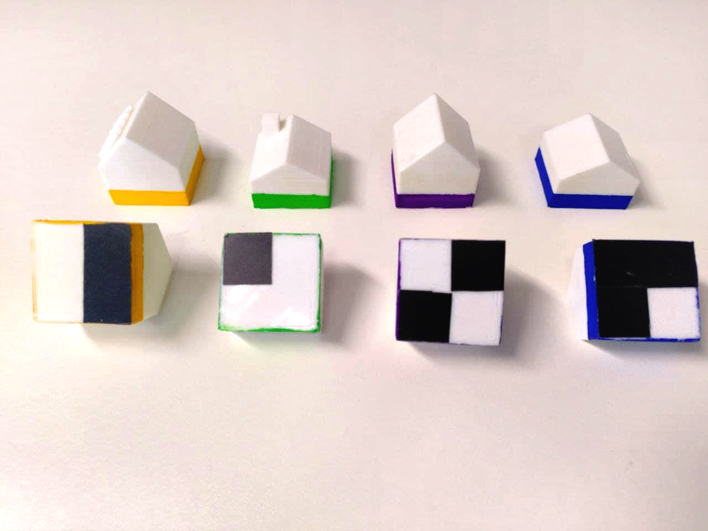

.. _cspy:

Tag Decoder (cspy)
##################

TODO: The framework is based on `MIT's CityScope platform <https://cityscope.media.mit.edu/>`_ and was developed by the `Department of Resilient Energy Systems <https://www.uni-bremen.de/res>`_ at the University of Bremen.

TODO: The image stream (camera) of the grid of tiles are scanned and decoded by :ref:`cspy<cspy>`. The software sends the grid information to the :ref:`frontend<frontend_usage>` (projector), which will cast an adjusted interface onto the table accordingly and send information about the machine state to the :ref:`infoscreen<infoscreen>` (TV) to display metadata. A GAMA Agent-Based-Model (:ref:`ABM<ABM>`) can be executed via interaction on the table. The data it outputs is stored locally and loaded by the infoscreen to display comprehensive graphs.

.. _installing_cspy:

Installation
************

TODO: install librealsense first!

After that, the installation will hopefully just as easy as downloading `the decoder's repository <https://www.github.com/quarree100/cspy>`_ and doing ``pip3 install -r requirements.txt``.

Programming
***********

.. _programming_tangibles:

Programming the Tags
====================

TODO: show how/where they are programmed.

TODO: description how they are read

.. _cspy_slider:

Slider
******

Additionally to the decoding of the grid of tiles, cspy can monitor slider objects, to facilitate gradual setting of values by the user.

#. TODO: explain the algorithm: camera looking for darkes pixel group along bar
#. TODO: explain positioning
#. TODO: information is sent to frontend as float and has to be processed there

TODO: Recommendation: place y-position of slider slightly ABOVE the slid, so you don't try to decode what's on the ceiling and other interferences with people.