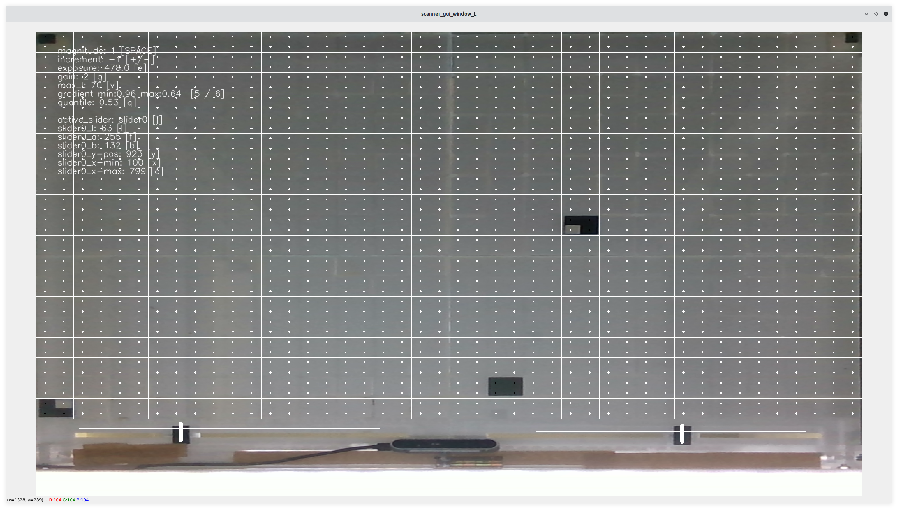

.. _cspy:

Introduction, Installation and Usage
####################################

Introduction
************

The framework is based on `MIT's CityScope platform <https://cityscope.media.mit.edu/>`_ and was further developed by the `City Science Lab at HafenCity University in Hamburg <https://www.hcu-hamburg.de/research/csl>`_ (CSL_HCU) and the `Department of Resilient Energy Systems <https://www.uni-bremen.de/res>`_ at the University of Bremen.
The code we used is indeed a combination of the MIT cityscopy scanner and further enhancements by the CSL_HCU. The algorithm splits the webcam stream into a grid of cells that are again separated into four quarters. Each quarter of each cell shows a dot indicating that the containing quarter is below a certain lightness threshold (→ black dot) or above it (→ bright dot). This way, cspy can register a set of 2^4 = 16 tags (neglecting their rotation), or about 3.5 absolute rotation-variable tags.

t hand side of the window show user controls for the calibration of the detection.

Above you see an image of the output of cspy, with the camera stream split into a grid of cells that is to be monitored. Below, there are two sliders that can be observed, too. Some information on the left hand side of the window show user controls for the calibration of the detection.

.. _installing_cspy:

Installation
************

Make sure you have your :ref:`camera drivers<realsense>` installed properly and your cameras are ready for usage.
After that, the installation will hopefully just as easy as downloading `the decoder's repository <https://www.github.com/quarree100/cspy>`_ and doing ``pip3 install -r requirements.txt``.

.. note::
    You should copy the downloaded folder to be able to run two instances of the software, each using their own settings.
    .. TODO: this could be done in an easier way, using a startup flag to define which settings file to load from (and save to)

Usage
*****

Since we are working with two physical tables and, thus, with two cameras, two instances of the software have to be started, each with their own keystone-calibrated settings.

**1.** Run ``python3 run_scanner.py [settings_file]``.

([settings_file] can for example be ``settings/qscope_R.json`` for the table on the right). But first, the webcams :ref:`will have to be calibrated<cspy_calibration>`.
