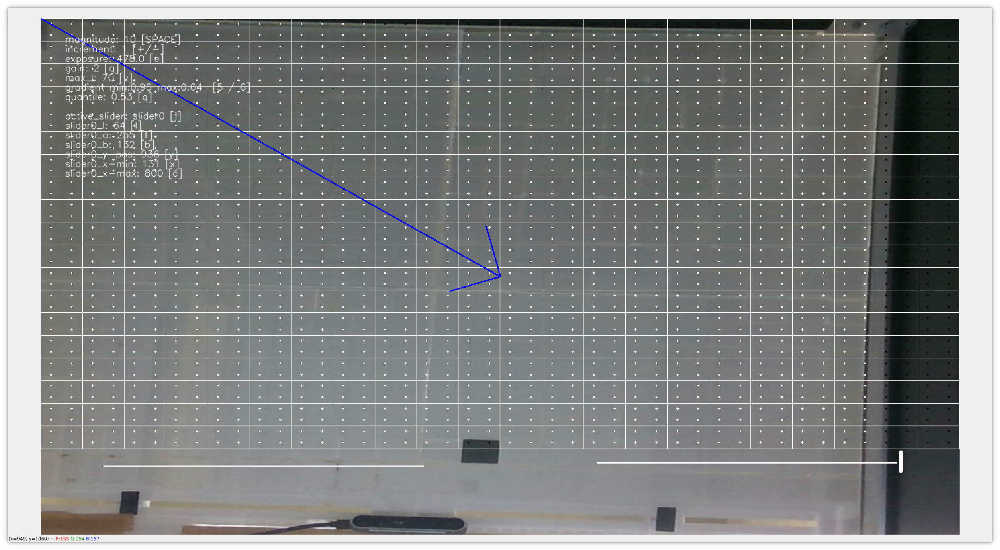

.. _cspy_calibration:

Calibrating the Webcams
=======================

Keystoning
----------

The webcams have to be calibrated so that the *ROI* (region of interest) extends properly over the whole area of the table underside.

**1.** For a rough definition of the ROI, run ``python3 run_keystone.py [settings_file]``.

.. hint:: Calibration with ``run_keystone.py`` only has to be conducted if the webcams' streams are roughly de-positioning. During normal usage of the setup (without moving it much), the webcams should stay more or less stable and can be fine-tuned like in step 3.

.. image:: ../img/cspy_00_keystoning.png
    :align: center
    :alt: image of underside of table with the extent of the whole physical grid

This is for roughly setting the corner points of the ROI. Usually this is only needed seldomly, like after moving or re-assembling the whole table. You will see the full extent of the camera stream. The camera should be installed so that the whole physical grid can be seen.

**2.** Now Select 4 corner points by clicking on each of them in the order: up right, up left, bottom right, bottom left. (The program will quit once the initial keystone points were saved.) The whole grid INCLUDING the sliders should be considered.

**3.** Run ``python3 run_scanner.py [settings_file]``.

You now see a close-up of the region of interest.

**4.** Press numbers ``1``, ``2``, ``3``, ``4``, to select the corner points.

**5.** Move the corner using ``WASD`` keys until the grid cells in the edges are placed neatly in the edges of the ROI and the white grid matches the grid of the physical table.

**6.** The step size for the displacing of the corner points can be toggled hitting `SPACEBAR`. A red arrow indicates slight movements, while a blue arrow indicates bigger steps.

**7.** Once everything is positioned nicely, press ``k`` to save the corner points to ``keystone.txt``. Corner points will be loaded from that file upon next start of the script.

.. hint::
    Placing non-white tokens in the very corners can be very helpful to set the absolute edges of the ROI.

.. _cspy_detection_settings:

Detection Settings
------------------

In total, more than the one webcam stream window is created with cspy - there are two additional windows that help finding the best detection conditions.

.. image:: ../img/cspy_all_windows.png
    :align: center
    :alt: Ideal calibration situation with three windows showing the original RGB webcam stream, the resulting image after brightness and threshold adjustments, and a greyscale overlay to even out uneven light distribution.

When running cspy, three windows are created: one showing the original RGB webcam stream, a second one showing the resulting (binary) image after brightness and threshold adjustments, and a third one showing a greyscale gradient overlay to even out uneven light distribution.

In an ideal calibration (like in the image above), the **binary image** should show the tags' black quarters as perfect white squares. No light should leak through the grid.

Setting up the best detection conditions requires a lot of fine-tuning of brightness and threshold levels. For this, a set of tools can be used via a keyboard:

**general:**

* ``+`` and ``-`` define whether your values will increase or decrease.
* ``SPACEBAR`` sets the magnitude of the change of the values.
* ``u``: toggle the gui interface

**1. lightness thresholds:**

* ``v``: change the overall pixels' luminance threshold.
* ``e``: (realsense-specific) adjust the camera's exposure
* ``g``: (realsense-specific) adjust the camera's gain

* ``q``: adjust the brightness threshold of the cell pixels' quantiles **hint: this will result in significant detection changes**

**2. gray gradient overlay:**

* ``5``: change the lower end of the grey gradient overlay
* ``6``: change the upper end of the grey gradient overlay

**3. sliders:**

* ``j``: toggle active slider through list of available sliders
* ``l``: change luminance threshold of active slider
* ``f``: change active slider's `a`-value
* ``b``: change active slider's `b`-value
* ``y``: change the y poisition of the active slider
* ``x``: change the left x position of the active slider
* ``c``: change the right x position of the active slider

After the calibration is complete, the values can be saved hitting ``k`` and will be written to the opened :ref:`settings file<cspy_settings>`. (You can select the settings file by appending it to the python execution command like so: ``python3 run_scanner.py settings/qscope_L.json``)

.. TODO: merge ``feature_export_calibration`` and ``beautifications`` to ``main``

.. hint:: Recommendation: place y-position of slider slightly ABOVE the slid, so you don't try to decode what's on the ceiling and other interferences with people.

.. attention:: Not all of these tools might work for you, since they are programmed specifically for the cameras we used. The exposure and gain controls only work for realsense cameras. For any other features you would have to implement your own functions.
