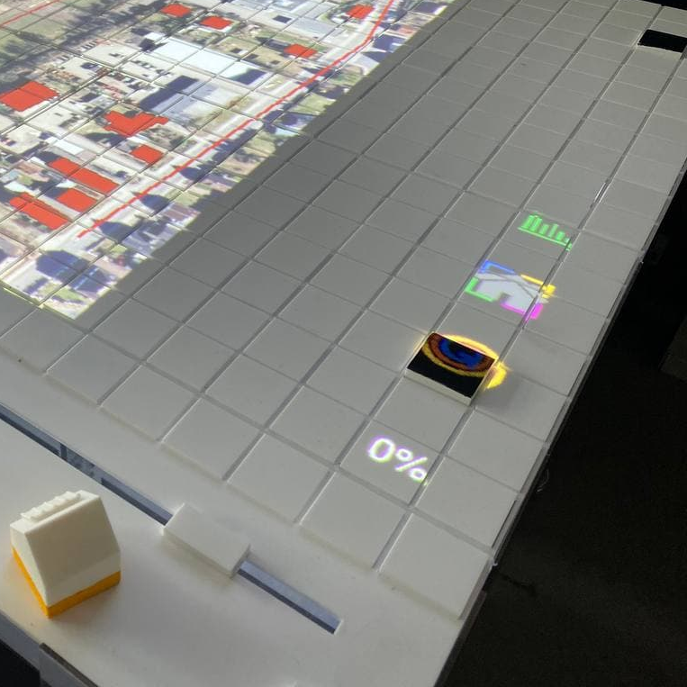

Frontend Interaction
####################

.. _grid:

Grid & Tiles
************

.. image:: ../img/grid_representations.png
  :align: center
  :alt: image of grid representations: photo of acrylic tiles, webcam stream from underneath, software representation in frontend

The grid objects are initialized in :ref:`frontend.py<frontend_communication>`. They are software representations of the physical grids' configuration and define how elements shown on the aerial map are to be displayed.

.. code-block:: python
  :caption: frontend.py

  for grid_, grid_udp in [[session.grid_1, grid_udp_1], [session.grid_2, grid_udp_2]]:
    udp_server = udp.UDPServer(*grid_udp, 4096)
    udp_thread = threading.Thread(target=udp_server.listen,
                                  args=(grid_.read_scanner_data,),
                                  daemon=True)
    udp_thread.start()

In the frontend code of our example, there are two grid objects, each representing a grid on one of the physical tables. Each of them starts a new thread to receive UDP messages with information on the grid cells' ids and their (absolute and relative) rotation

All cells have an ID that can be any number ranging from 0 (corresponding a tangible with a white underside) through 5 (codes on the underside). Once a cell gets an ID that is not 5 (white), it is considered to be "selected". As a result, :ref:`a broader frame<draw_simple_polygon_layer>` will be drawn around it (see image above). Then it can be addressed via one of the :ref:`sliders<frontend_slider_setup>`, information on the object will be displayed on the infoscreen, certain functions can be triggered upon selections, such as :ref:`mode <modeselector>` switching.

Some cells can be programmed to trigger additional events, like leaving the current :ref:`game mode<mode>`. This is done via tables in ``q100viz/settings/``. Read more on how to program link functions to cells :ref:`here<programming_cell_functions>`.

.. hint::
  The grid display can be toggled using the ``g`` key. In the upper left corner of each cell, the cell's ID is displayed. The number in the upper right corner represents the cell's current rotation.

.. _frontend_grid_setup:

Grid Setup
==========

The grid objects contain lists of cells, which can be addressed using enumeration routines:

.. code-block:: python
  :caption: access cells by iterating the grids

  # iterate grid:
  for grid in [session.grid_1, session.grid_2]:
      for y, row in enumerate(grid.grid):
          for x, cell in enumerate(row):
            # do cell operation

.. _grid_coordinates:

grid coordinates:
-----------------

The positions of the cells are stored in ``grid.rects_transformed``. This variable contains coordinates of the absolute pixel positions **after** their keystone-transformation on the canvas.

.. code-block:: python

  for i, (cell, coords) in enumerate(session.grid_1.rects_transformed):
      print("{0}: ({1}|{2}): {3}".format(i, cell.x, cell.y, coords))

  # returns:
  '''
  0: (0|0): [[134.9009246826172, 4.38118839263916], [134.4179229736328, 37.4811897277832], [167.75010681152344, 38.0572509765625], [168.22642517089844, 4.963389873504639]]
  1: (1|0): [[168.22642517089844, 4.963389873504639], [167.75010681152344, 38.0572509765625], [201.06971740722656, 38.633094787597656], [201.53933715820312, 5.545371055603027]]
  2: (2|0): [[201.53933715820312, 5.545371055603027], [201.06971740722656, 38.633094787597656], [234.37672424316406, 39.20872497558594], [234.8396759033203, 6.127132415771484]]
  3: (3|0): [[234.8396759033203, 6.127132415771484], [234.37672424316406, 39.20872497558594], [267.6711730957031, 39.78413391113281], [268.12744140625, 6.708674430847168]]
  4: (4|0): [[268.12744140625, 6.708674430847168], [267.6711730957031, 39.78413391113281], [300.9530334472656, 40.35932922363281], [301.4026184082031, 7.28999662399292]]
  5: (5|0): [[301.4026184082031, 7.28999662399292], [300.9530334472656, 40.35932922363281], [334.2223205566406, 40.934303283691406], [334.6652526855469, 7.871099472045898]]

  '''

Grid Interaction
================

The grid is either updated when interacting with a computer mouse (left- right- or middle-click on the cells) or if the :ref:`tag decoder<cspy>` detects a change in the physical grid. In the latter case, a json-formatted string is sent to the frontend via UDP and decoded in the according grid. Take a look at the code :ref:`here<read_scanner_data>`
In either case, the function `gis.get_intersection_indexer` is called from ``grid.get_intersection``, checking for overlapping polygons with the selected cell.

.. _modeselector:

ModeSelector
------------

A ModeSelector is a specific cell on the grid, which, when selected via token, activates a certain Mode.

On the right side there are four cells dedicated for the swichting of the :ref:`game stages<mode>`. If a non-white token is placed here, a countdown will start, after which the selected stage is entered. The countdown is implemented in order to avoid modes to be entered accidentally. As explained :ref:`below<programming_cell_functions>`, specific cell functions can be programmed using csv tables in ``q100viz/settings``.

.. _programming_cell_functions:

Programming Cell Functions
--------------------------

In order to create a new game mode or make a cell "do something" upon selection/interaction, functions can be allocated to cells by adjusting the tables in ``q100viz/settings/``. All .csv files are used to assign functionality to grid cells by combining the cell's coordinates with a certain handle and color.

A table can look like this:

.. csv-table:: grid initialization - q100viz/settings/buildings_interaction_grid_1.csv
  :header: "x", "y", "handle", "color"

  0,18,connection_to_heat_grid,#0075b4
  2,18,refurbished,#0075b4
  4,18,save_energy,#0075b4
  11,18,connection_to_heat_grid,#fdc113
  13,18,refurbished,#fdc114
  15,18,save_energy,#fdc115

The handles for game mode switching have to match one of the strings defined in ``session.MODE_SELECTOR_HANDLES``.: ``'start_individual_data_view', 'start_total_data_view', 'start_buildings_interaction', 'start_simulation'``. You can find more on how these "Mode Selectors" work in :ref:`the according section<modeselector>`.

valid handles are:

**household-individual handles:** are set in ``session.VALID_DECISION_HANDLES``: ``'connection_to_heat_grid', 'refurbished', 'save_energy'``

**mode selection handles**: ``'start_individual_data_view', 'start_total_data_view', 'start_buildings_interaction', 'start_simulation'``

**colors** can be set using strings from this list: https://www.pygame.org/docs/ref/color_list.html

.. _sliders:

Sliders
*******

The Sliders are interactive objects at the user-side of the projection. They comprise the slider itself and associated "slider handles" that define, what the slider actually does - in :ref:`our use case<quarree>` the users can allocate one of the following functions to the slider:
* the selected house will apply energy-saving measures (Yes/No bool)
* the selected house will be connected to the heat grid in the year X (int)
* the selected house will be refurbished in the year X (int)

The position of the physical slider is read by the :ref:`tag decoder software<cspy>`, which sends a float between 0 (slider at left margin) and 1 (slider at right margin) to the frontend. For more details on how the camera backend processes the slider, go to the :ref:`cspy section<cspy_slider>`.

 TODO: add image!

.. _frontend_slider_setup:

There is a dedicated `Slider` lass in ``q100viz/interaction/interface.py`` that can be used to create slider objects. Slider objects can store information on the active slider handle and the current slider value, corresponding the phyiscal slider on the table. There are variables to define the position of the slider on the projection area. This is important for the accurate projection of features on the very position of the slider. For this, `physical_diff_L` and `physical_diff_R` are variables describing the distance FROM the left margin of the area used for slider detection in cpsy, and the distance TO the right margin of the focused area in cspy (in cm), respectively. These are set in ``config.py`` and adapted to the sliders upon initialization.

Slider Functions
================

**q100viz/interaction/interface.py:**

* The Slider's ``draw_controls()`` function will render slider handle texts and icons, as well as tool tips.
* ``draw_area()`` draws option-specific layout onto the slider area. According to the use case, the area can either be a red/green field for binary yes/no option or show a timeline with the selection of specific year.
* ``process_value()``: processes incoming slider values and sets the value for the variable previously selected via the slider handles. The function is regularly executed in the :ref:`grid.read_scanner_data<read_scanner_data>` function, which is called whenever new UDP messages are coming in from the backend.
  #. Check if the slider value has changed (if yes, continue)
  #. According to the currently active handle, change the value of the active variable using the slider's value (and multiplicators for integers or thresholds for bools)

* TODO: link to API overview section
