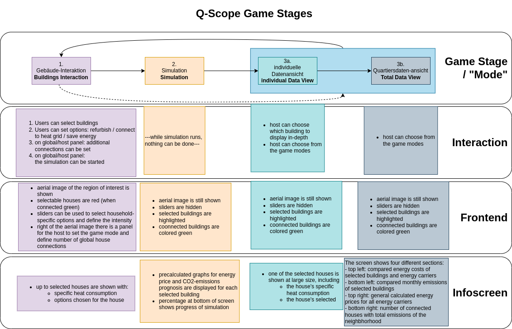

.. _frontend_programming:

Programming
###########

.. _frontend_initialization:

Initialization
**************

Config file
===========

To configure the frontend, the file ``q100viz/settings/config.py`` can be changed before running the application.

.. note:: Make yourself a copy of the file config.py and adjust it according to the context you want to use the setup. We had different scenarios for different workshop participants.

Here you can modify the path of files being imported/exported, :ref:`change the source file and the simulation time for the agent-based-model<simulation_setup>`, save information of the extents of the :ref:`grids<frontend_grid_setup>` and the :ref:`sliders<frontend_slider_setup>` here. The individual adjustments will be discussed in the according sections, respectively.

.. _session:

Session file
============

The file ``q100viz/session.py`` is a container for global variables. The file does some initial variable assignment, so that we won't stumble across any NoneType errors later on. Some config variables will be stored here with more accessible variable names (rather than having to use python dictionaries all the time). You'll basically find anything that needs to be referred to from different parts throughout the code here, such as :ref:`variables used for Debugging<devtools>`.
In the following graphics section, the pygame viewport is loaded and :ref:`keystone transformation<keystone_transformation>` is perfomed.
Furthermore, a `buildings` variable is created as an instance of the :ref:`Buildings class<buildings>`, which represents the houses the users can interact with. It is a DataFrame that is very commonly referred to in the project, as it stores polygon data and metadata of the GIS objects.

.. _environment:

Further contents of the code are:
- The `environment` variable that stores information about the machine state, like the current game mode and iteration, global scenarios regarding the energy prices, current state of houses connected to the heat grid. It is used mostly to transfer data to the infoscreen.

.. _scenario:

- A scenario for possible energy prices and further settings affecting the dynamics of the agent-based-model are set here as well. The source csv files for this lie in the :ref:`data folder<data>`.
- Initialization of  GIS objects, such as the geographic canvas extents and the basemap file are initialized
- Initialization of the :ref:`grid<grid>` objects. These are the cells representing the physical tiles on the table. They mirror the physical interaction and can be addressed by a grid object that is sent from the :ref:`The tag decoder software<cspy>` tag decoder at each interaction.
- Initialization of the _modes. The different game stages are stored in a variable called ``modes``.

.. _buildings:

Buildings
*********

How are the buildings you see on the map colored and how can they be accessed? Most of the interaction in the QUARREE100 project is done via selection of buildings on an aerial map. The source data for these building polygons comes from a :ref:`Shapefile in the data folder<architecture>`

The ``Buildings`` class is basically one large DataFrame containing all metadata about the buildings taken from a shapefile. The source file contains information about the houses addresses, specific heat consumption, energy carrier, building type, etc.
Only existing buildings are regarded.
The buildings can be clustered in groups according to similar heat consumptions:

.. code-block:: python

      def make_clusters(self, start_interval):
        '''make groups of the selected buildings. group by standard deviation of energy consumption'''
        cluster_list = []
        for idx in range(len(self.df.index)):
            interval = start_interval  # standard deviation
            cluster = pandas.DataFrame()
            while len(cluster) < 2:  # make sure no building is alone
                cluster = self.df.loc[(
                        (self.df['energy_source'] == self.df.loc[
                            self.df.index[idx], 'energy_source'])
                        &
                        (self.df['spec_heat_consumption'] >= self.df.loc[self.df.index[idx],
                        'spec_heat_consumption'] - self.df['spec_heat_consumption'].std() * interval)
                        &
                        (self.df['spec_heat_consumption'] <= self.df.loc[self.df.index[idx],
                        'spec_heat_consumption'] + self.df['spec_heat_consumption'].std() * interval)
                        &
                        (self.df['spec_power_consumption'] >= self.df.loc[self.df.index[idx],
                        'spec_power_consumption'] - self.df['spec_power_consumption'].std() * interval)
                        &
                        (self.df['spec_power_consumption'] <= self.df.loc[self.df.index[idx],
                        'spec_power_consumption'] + self.df['spec_power_consumption'].std() * interval)
                    )]
                interval += 0.1  # increase range, try again if necessary

            cluster_list.append(cluster)
            devtools.print_verbose(
                "building {0} is in a group of to {1} buildings with similar specs:".format(self.df.index[idx], len(cluster)), session.VERBOSE_MODE, session.log)
            # devtools.print_verbose(cluster[['spec_heat_consumption', 'spec_power_consumption']].describe(), session.VERBOSE_MODE)

        return cluster_list

Further information such as paths for pre-generated graphics are added. The DataFrame will later comprise images exported by the :ref:`ABM<abm>` to be forwarded to and shown at the infoscreen.

.. note::

  "Behavior" data such as the connection to the QUARRE100-heat-grid, refurbishment of the house or energy-saving measures are pre-set in the following manner: ``false``, if house's energy_source (in source data) is not ``None``, else the house will come in pre-connected and refurbished.

Buildings can either be ``selected`` by a user or not. Selection is done if a cell is selected on the table (by placing a token physically). :ref:`The tag decoder software<cspy>` will detect any interaction with the table surface and forward the grid information to the frontend to be deciphered in the ``grid.py``: :ref:`read_scanner_data<read_scanner_data>` function.
The Buildings class contains additional functions, e.g. ``find_closest_heat_grid_line`` for graphical calculations and functions to organize, convert and export the DataFrame for specific needs.

GIS
***

The file `gis.py` contains two classes:

1. **The GIS class** draws features from the source Shapefile, like polygons and lines, onto the canvas_. It provides functions to draw the whole polygon layer at once, color them in a certain style (e.g. according to heat grid connection status), etc.
2. **The Basemap class** initiates and warps the basemap image.

Positioning of the GIS layers is done during :ref:`initialization<session>` of the GIS class object, where the corner points of the ROI (region of interest) extent are set:

.. code-block:: python

  _gis = gis.GIS(
    config['CANVAS_SIZE'],
    # northeast          northwest           southwest           southeast
    [[1013631, 7207409], [1012961, 7207198], [1013359, 7205932], [1014029, 7206143]],
    viewport)

  basemap = gis.Basemap(
      config['CANVAS_SIZE'], config['BASEMAP_FILE'],
      # northwest          southwest           southeast           northeast
      [[1012695, 7207571], [1012695, 7205976], [1014205, 7205976], [1014205, 7207571]],
      _gis)

.. note::
  Some other ROIs we tested in QUARREE100 were:

  **kleinerer Kartenausschnitt:**

   _gis = session.gis = gis.GIS(canvas_size, [[1013578, 7207412], [1013010, 7207210], [1013386, 7206155], [1013953, 7206357]], viewport)

  **mit Input Area am linken Rand und Aussparung unten:**

    _gis = session.gis = gis.GIS(canvas_size, [[1013554, 7207623], [1012884, 7207413], [1013281, 7206147], [1013952, 7206357]], viewport)

  **mit Input Area am rechten Rand und Aussparung unten:**

    gis = session.gis = gis.GIS(canvas_size, [[1013631, 7207409], [1012961, 7207198], [1013359, 7205932], [1014029, 7206143]], viewport)

.. _canvas:

Canvas setup
************

The whole frontend was programmed using `pygame <pygame.org>`_ - a set of Python modules designed for writing video games. Pygame will create a graphical canvas, running in the loop, which will change its appearance according to user action.

.. _frontend_class:

The frontend class itself is defined in ``q100viz/frontend.py``.
Upon initialization of the frontend class, the pygame environment is created. Things like the display framerate, window position etc can be set here.

.. _frontend_setup_window:

window position and size
========================

You can set the window's position using the os module:

.. code-block:: python
  :caption: frontend.py

    # window position (must be set before pygame.init!)
    if not run_in_main_window:
        os.environ['SDL_VIDEO_WINDOW_POS'] = "%d,%d" % (
            0, 2560)  # projection to the left

    # window size:
    canvas_size = session.config['CANVAS_SIZE']
    self.canvas = pygame.display.set_mode(canvas_size, NOFRAME)
    pygame.display.set_caption("q100viz")

For this setting, the monitors should be organized as follows:

.. image:: ../img/frontend_screen-position.png
  :align: center
  :alt: [Image of two schematic monitors, above each other and aligned left]

The canvas is masked by a layer that defines the margins of the region of interest (ROI). The following list of points defines the extent of a masking polygon:

.. code-block:: python
  :caption: frontend.py

    self.mask_points = [[0, 0], [85.5, 0], [85.5, 82], [0, 82], [0, -50],
                    [-50, -50], [-50, 200], [200, 200], [200, -50], [0, -50]]

Finally, a seperate thread for UDP observation is started. Each table ("grid") has a seperate communication thread. More about how communication between tag decoder, frontend and infoscreen works in the :ref:`Communication <frontend_communication>` section.

.. _grid:

Grid & Tiles
************

.. image:: ../img/grid_representations.png
  :align: center
  :alt: image of grid representations: photo of acrylic tiles, webcam stream from underneath, software representation in frontend

The grid objects are initialized in :ref:`frontend.py<frontend_communication>`. They are software representations of the physical grids' configuration and define how elements shown on the aerial map are to be displayed.

.. code-block:: python
  :caption: frontend.py

  for grid_, grid_udp in [[session.grid_1, grid_udp_1], [session.grid_2, grid_udp_2]]:
    udp_server = udp.UDPServer(*grid_udp, 4096)
    udp_thread = threading.Thread(target=udp_server.listen,
                                  args=(grid_.read_scanner_data,),
                                  daemon=True)
    udp_thread.start()

In the frontend code of our example, there are two grid objects, each representing a grid on one of the physical tables. Each of them starts a new thread to receive UDP messages with information on the grid cells' ids and their (absolute and relative) rotation

 All cells have an ID that can be any number ranging from 0 (corresponding a tangible with a white underside) through 5 (codes on the underside). Once a cell gets an ID that is not 5 (white), it is considered to be "selected". As a result, :ref:`a broader frame<draw_simple_polygon_layer>` will be drawn around it (see image above). Then it can be addressed via one of the :ref:`sliders<frontend_slider_setup>`, information on the object will be displayed on the infoscreen, certain functions can be triggered upon selections, such as :ref:`mode <modeselector>` switching.

Some cells can be programmed to trigger additional events, like leaving the current game mode. This is done via tables in `q100viz/settings/`. A table can look like this:

.. csv-table:: grid initialization - q100viz/settings/buildings_interaction_grid_1.csv
  :header: "x", "y", "handle", "color"

  0,18,connection_to_heat_grid,#0075b4
  2,18,refurbished,#0075b4
  4,18,save_energy,#0075b4
  11,18,connection_to_heat_grid,#fdc113
  13,18,refurbished,#fdc114
  15,18,save_energy,#fdc115

The handles for game mode switching have to match one of the strings defined in `session.MODE_SELECTOR_HANDLES`.: `'start_individual_data_view', 'start_total_data_view', 'start_buildings_interaction', 'start_simulation'`. You can find more on how these "Mode Selectors" work in :ref:`the according section<modeselector>`.

.. hint::
  The grid display can be toggled using the `g` key. In the upper left corner of each cell, the cell's ID is displayed. The number in the upper right corner represents the cell's current rotation.

.. _frontend_grid_setup:

grid setup
==========

The grid objects contain lists of cells, which can be addressed using enumeration routines:

.. code-block:: python
  :caption: access cells by iterating the grids

  # iterate grid:
  for grid in [session.grid_1, session.grid_2]:
      for y, row in enumerate(grid.grid):
          for x, cell in enumerate(row):
            # do cell operation

.. _grid_coordinates:

grid coordinates:
=================

The positions of the cells are stored in ``grid.rects_transformed``. This variable contains coordinates of the absolute pixel positions **after** their keystone-transformation on the canvas.

.. code-block:: python

  for i, (cell, coords) in enumerate(session.grid_1.rects_transformed):
      print("{0}: ({1}|{2}): {3}".format(i, cell.x, cell.y, coords))

  # returns:
  '''
  0: (0|0): [[134.9009246826172, 4.38118839263916], [134.4179229736328, 37.4811897277832], [167.75010681152344, 38.0572509765625], [168.22642517089844, 4.963389873504639]]
  1: (1|0): [[168.22642517089844, 4.963389873504639], [167.75010681152344, 38.0572509765625], [201.06971740722656, 38.633094787597656], [201.53933715820312, 5.545371055603027]]
  2: (2|0): [[201.53933715820312, 5.545371055603027], [201.06971740722656, 38.633094787597656], [234.37672424316406, 39.20872497558594], [234.8396759033203, 6.127132415771484]]
  3: (3|0): [[234.8396759033203, 6.127132415771484], [234.37672424316406, 39.20872497558594], [267.6711730957031, 39.78413391113281], [268.12744140625, 6.708674430847168]]
  4: (4|0): [[268.12744140625, 6.708674430847168], [267.6711730957031, 39.78413391113281], [300.9530334472656, 40.35932922363281], [301.4026184082031, 7.28999662399292]]
  5: (5|0): [[301.4026184082031, 7.28999662399292], [300.9530334472656, 40.35932922363281], [334.2223205566406, 40.934303283691406], [334.6652526855469, 7.871099472045898]]

  '''

grid interaction
================

The grid is either updated when interacting with a computer mouse (left- right- or middle-click on the cells) or if the :ref:`tag decoder<cspy>` detects a change in the physical grid. In the latter case, a json-formatted string is sent to the frontend via UDP and decoded in the according grid. Take a look at the code :ref:`here<read_scanner_data>`
In either case, the function `gis.get_intersection_indexer` is called from `grid.get_intersection`, checking for overlapping polygons with the selected cell.

.. _frontend_game_loop:

Frontend Game Loop
******************

After :ref:`initialization<frontend_initialization>`, the frontend will run in a loop to :ref:`update the projection<projection_routine>`, evaluate keyboard input, handle the :ref:`game modes<modeselector>`, process :ref:`slider events<slider_events>`, and finally, :ref:`update the pygame environment<update_pygame_environment>`.

.. _key_events:

The following key events are implemented in the `QUARREE100 <https://www.quarree100.de>`_ example project:

- `p` toggle the display of GIS polygons
- `m` toggle basemap visibility
- `g` toggle visibility of grid outline and cell ID, rotation, coordinates
- `n` toggle visibility of the heat grid
- `b` toggle the black mask on viewport
- `3` start buildings_interaction_ mode
- `4` start simulation_mode_
- `5` start individual_data_view_ mode
- `6` start total_data_view_ mode

Projection
==========

.. _projection_routine:

The frontend image is composed of a set of layers, which are rendered ontop of each other in the following order:

#. draw polygons to _gis.surface
#. draw grid outĺine to grid.surface
#. draw mask to session.viewport
#. draw basemap to frontend.canvas
#. draw mode-specific surface (what does this do?)
#. render GIS layer: _gis.surface to frontend.canvas
#. slider: draw polygons, icons and text to slider.surface
#. draw grid.surface to frontend.canvas
#. draw session.viewport to frontend.canvas

.. note::
  More notes on how to use simple pygame features can be found in the :ref:`Frontend/pygame section! <simple_pygame_features>`

Drawing polygons
----------------

TODO: explain GIS functions

Drawing of Sliders
------------------

The sliders have a bool called ``show_text`` that, when ``True``, activates the display of the slider control texts. This variable can be used for the usage modes to define whether the slider controls shall be displayed.

Drawing Heat Grid Lines
-----------------------

// TODO:

#. Buildings.find_closest_heat_grid_line
#. draw the line

.. _pygame_environment_update:

Pygame Environment Update
=========================

TODO: tick, what are ticks_elapsed and seconds_elapsed used for?

.. _calibration_mode:

Calibration
***********

.. _keystone_transformation:

keystone transformation
=======================

general information on image transofrmation using opencv:

`tutorial_py_geometric_transformations <https://docs.opencv.org/3.4/da/d6e/tutorial_py_geometric_transformations.html>`_

`using cv.perspectiveTransform for vectors <https://docs.opencv.org/3.4/d2/de8/group__core__array.html#gad327659ac03e5fd6894b90025e6900a7>`_
and `cv.warpPerspective for images <https://docs.opencv.org/3.4/da/d54/group__imgproc__transform.html#gaf73673a7e8e18ec6963e3774e6a94b87>`_

**adding a new surface, draw on it and transform it:**

.. code-block:: python

  class SomeClass:
    # session.canvas_size = 1920, 1080
    self.surface = keystone.Surface(session.canvas_size, pygame.SRCALPHA)

    # x_size, y_size = 22, 22
    self.surface.src_points = [[0, 0], [0, y_size], [x_size, y_size], [x_size, 0]]
    self.surface.dst_points = [
        [config['X1'], config['Y1']],
        [config['X1'], config['Y2']],
        [config['X2'], config['Y2']],
        [config['X2'], config['Y1']]]
    # where e.g. X1 = 0, X2 = 50, Y1 = 0, Y2 = 81.818

    def draw(self, viewport):

      pygame.draw.polygon(self.surface, pygame.Color(255, 255, 255), [[20, 70], [20, 20], [80, 20], [80, 70]])  # render polygon

      viewport.blit(self.surface, (0,0))  # cast it to viewport

in file ``q100viz/keystone.py``

frontend representation
-----------------------

* slider uses the transformation of the :ref:`grid<grid>`
* **drawing of polygons and values** should be done via ``self.surface.blit(...)``. Slider surface is rendered and "blitted" to main canvas.

``print(slider.coords_transformed)`` returns:

.. code-block::

  [[860.9641723632812, 915.1583862304688],
  [863.9833984375, 614.8511352539062],
  [1228.917724609375, 622.6510009765625],
  [1226.5196533203125, 923.7374267578125]]

with ``[[bottom-left[x], bottom-left[y]], [upper-left[x], upper-left[y]], [upper-right[x], upper-right[y]], [bottom-right[x], bottom-right[y]]]``

.. _frontend_mode:
.. _mode:

Game Modes
**********

TODO: general mode functions.. e.g. each mode checks for intersections with grid

* In the :ref:`QUARREE100 use case<quarree>` there are different machine states, defined by the files in ``q100viz/interaction/`` → these are the modes the program is running at (per time)
* implemented modes are:
    * :ref:`Interaction <buildings_interaction>`
    * :ref:`Simulation <simulation_mode>`
    * :ref:`Data View <data_view>`
    * :ref:`Calibration<calibration_mode>`

TODO: is this right, or shall the mode be activated via session.current_mode = mode??: each mode has a function called ``activate()`` which is used to (re-)active the mode and set the specific display settings accordingly. Do I want to see a slider (or two)? Shall the basemap be visible? Define it here.

TODO: game mode is activated in frontend loop:
- it runs `session.active_mode.activate()` when new mode was set

The ``__init__`` function is seldomly used, since it will be run in the beginning of the script (in ``session.py``), before the variables (e.g. ``grid``) are initialized.

Specification of mode selector cells can be done by adjusting the tables in `q100viz/settings/`. All .csv files are used to assign functionality to grid cells by combining the cell's coordinates with a certain handle and color.

valid handles are:

**household-individual handles:** are set in `session.VALID_DECISION_HANDLES`: `'connection_to_heat_grid', 'refurbished', 'save_energy'``

**mode selection handles**: `'start_individual_data_view', 'start_total_data_view', 'start_buildings_interaction', 'start_simulation'`

**colors** can be set using strings from this list: https://www.pygame.org/docs/ref/color_list.html

The Modes can be switched using either the input keys:

- `3` activates the :ref:`Buildings Interaction<buildings_interaction>`
- `4` starts the simulation
- `5` enters the :ref:`individual data view<individual_data_view>`
- `6` enters the :ref:`total (neighborhood) data view<total_data_view>`
- `C` starts the :ref:`Calibration Mode<calibration_mode>`

.. _buildings_interaction:

Buildings Interaction
=====================
In the Input Mode, users can set household-, buildings- global parameters. They can leave the mode placing a token on the "simulation mode" selector.

.. _simulation_mode:

Simulation
==========
The Simulation can be started using ``S`` key. It will generate an experiment API file for GAMA according to this scheme: https://gama-platform.org/wiki/Headless#simulation-output and run the provided model file using the gama-headless.sh . These two files are to be set up in ``config.py``.

.. _simulation_setup:

Setting up the simulation
-------------------------

TODO:

... will start the GAMA headless simulation and wait for the results.
Q-Scope needs to know where to find GAMA's ``gama-headless.sh`` file, which can be found in the extracted folder ``gama/headless``. Set this up in ``config.py``, providing the headless folder and the location of the gama model file:

.. code-block:: python

  'GAMA_HEADLESS_FOLDER' : '/home/qscope/GAMA/headless/',
  'GAMA_MODEL_FILE' : '../q100_abm/q100/models/qscope_ABM.gaml',

**ATTENTION**: make sure to set the user rights of ``gama-headless.sh`` executable via ``chmod u+x gama-headless.sh``

.. _data_view:
.. _individual_data_view:

Individual Data View
====================

.. _total_data_view:

Total Data View
===============

User Interface
**************

.. _sliders:

Sliders
=======

.. _frontend_slider_setup:

TODO: how to define and setup the sliders.

.. _slider_events:

TODO: how to use the sliders, what happens if you use them

.. _modeselector:

ModeSelector
============

A ModeSelector is a specific cell on the grid, which, when selected via token, activates a certain Mode.

TODO: explain how a mode is triggered and hint: do not use mode.activate() but session.active_mode = mode

.. _devtools:

Debugging and Devtools
**********************

TODO: session.log
TODO: session.VERBOSE_MODE
TODO: debug_num_of_random_buildings, debug_connection_date,debug_force_refurbished, debug_force_save_energy

TODO: refer to key_events_