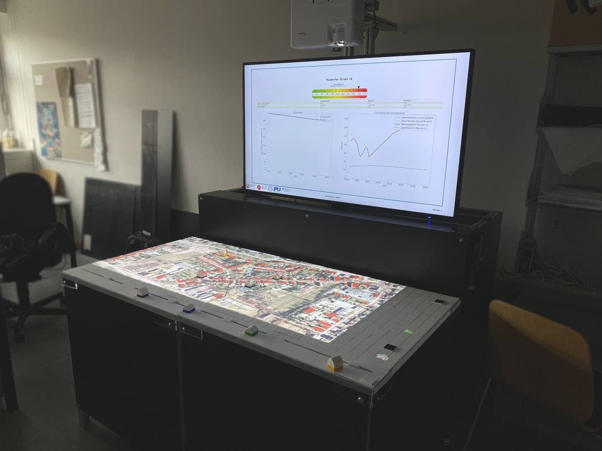

.. qScope-doc documentation master file, created by
   sphinx-quickstart on Fri Feb 25 12:34:18 2022.
   You can adapt this file completely to your liking, but it should at least
   contain the root `toctree` directive.

Welcome to qScope's documentation!
==================================

Q-Scope is a framework for interactive visualization using tangible objects on a physical table. It is used as a decision support tool for participation processes in energy transition research. The framework is based on `MIT's CityScope platform <https://cityscope.media.mit.edu/>`_ and was developed by the `Department of Resilient Energy Systems <https://www.uni-bremen.de/res>`_ at the University of Bremen.

he tables there are two webcams to scan the grids' current setup at every instance.

The code can be found on `GitHub <https://github.com/quarree100/qScope_frontend/>`_.

Guide
^^^^^

.. toctree::
   :maxdepth: 2
   :caption: Q-Scope

   QUARREE100
   setup

.. toctree::
   :maxdepth: 2
   :caption: Frontend

   frontend/01_install_start
   frontend/02_init
   frontend/03_frontend_display
   frontend/04_frontend_interaction
   frontend/05_game_modes
   frontend/06_devtools
   frontend/misc

.. toctree::
   :maxdepth: 2
   :caption: Tag decoder (cspy)

   cspy/installation_usage.rst
   cspy/setup.rst
   cspy/calibration.rst

.. toctree::
   :maxdepth: 2
   :caption: Infoscreen

   infoscreen

.. toctree::
   :maxdepth: 2
   :caption: ABM

   ABM

.. toctree::
   :maxdepth: 2
   :caption: API

   API/frontend_API
   API/infoscreen_API.rst
   API/tag_decoder_API.rst
