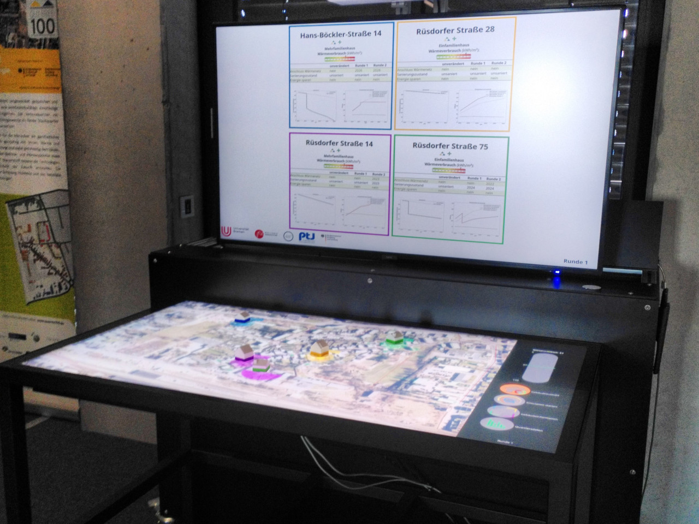

.. qScope-doc documentation master file, created by
   sphinx-quickstart on Fri Feb 25 12:34:18 2022.
   You can adapt this file completely to your liking, but it should at least
   contain the root `toctree` directive.

Welcome to qScope's documentation!
==================================

Q-Scope is a framework for interactive visualization using tangible objects on a physical table. It is used as a decision support tool for participation processes in energy transition research. The framework was developed by the `Department of Resilient Energy Systems <https://www.uni-bremen.de/res>`_ at the University of Bremen.

The code can be found on `GitHub: quarree100/qScope_frontend <https://github.com/quarree100/qScope_frontend/>`_.
Some more context is provided at `uni-bremen.de/res/methoden/decision-support-tools <https://www.uni-bremen.de/res/methoden/decision-support-tools#c534829-q-scope>`_

.. toctree::
   :maxdepth: 1
   :caption: Framework Installation

   Installation

Version 3: Q-Scope Tangibles
****************************

The third iteration of the Q-Scope makes use of the Tangible Objects that can be used on the Interactive Scape Touch Table.

* :doc:`TUIO Setup and Usage <03_Tangibles/Q-Scope_Tangibles>`
* :doc:`03_Tangibles/TUIO_Python`
* :doc:`Tangibles Frontend <03_Tangibles/Tangible_Frontend>`

.. toctree::
   :maxdepth: 1
   :caption: Version 3: Q-Scope Tangibles
   :hidden:

   TUIO Setup and Usage <03_Tangibles/Q-Scope_Tangibles>
   03_Tangibles/TUIO_Python
   Tangibles Frontend <03_Tangibles/Tangible_Frontend>

Version 2: Q-Scope Touch
****************************

* :doc:`Specifications and Usage <02_Touch/Q-Scope_Touch>`
* :doc:`Touch Frontend <02_Touch/Touch_Interaction>`

.. toctree::
   :maxdepth: 1
   :caption: Version 2: Q-Scope Touch
   :hidden:

   Specifications and Usage <02_Touch/Q-Scope_Touch>
   Touch Frontend <02_Touch/Touch_Interaction>

Version 1: Q-Scope Grid
***********************

he tables there are two webcams to scan the grids' current setup at every instance.

Based on `MIT's CityScope platform <https://cityscope.media.mit.edu/>`_, the first iteration of Q-Scope used a grid of acrylic plates users could interact with. According to the users input, the frontend was projected from above.

* :doc:`QUARREE100 Project Description <01_Grid/QUARREE100>`
* :doc:`01_Grid/setup`
* :doc:`01_Grid/quick_setup`
* :doc:`01_Grid/frontend/01_install_start`
* :doc:`Backend / Tag Decoder <01_Grid/cspy/00_intro_install_usage>`
* :doc:`01_Grid/infoscreen`
* :doc:`01_Grid/ABM`
   
.. toctree::
   :maxdepth: 1
   :caption: Version 1: Q-Scope Grid
   :hidden:

   QUARREE100 Project Description <01_Grid/QUARREE100>
   01_Grid/setup
   01_Grid/quick_setup
   01_Grid/frontend/01_install_start
   Backend / Tag Decoder <01_Grid/cspy/00_intro_install_usage.rst>
   01_Grid/infoscreen
   01_Grid/ABM
