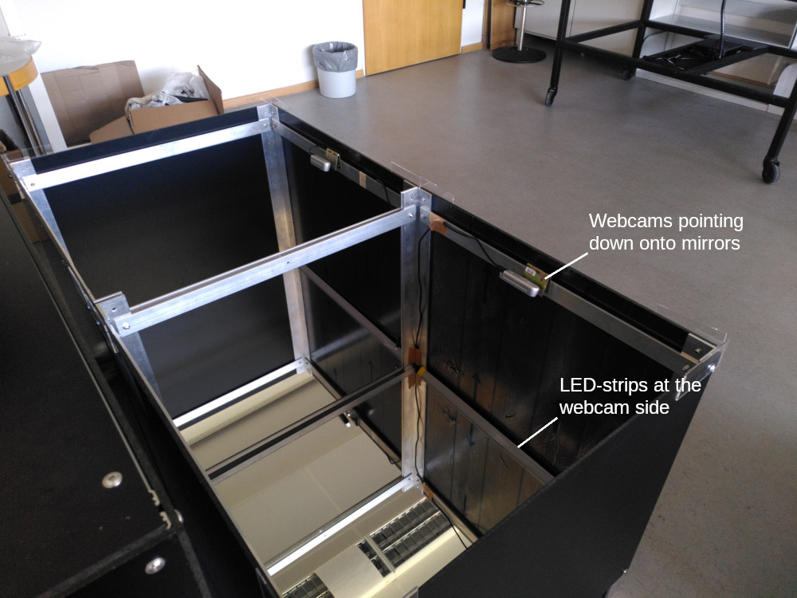
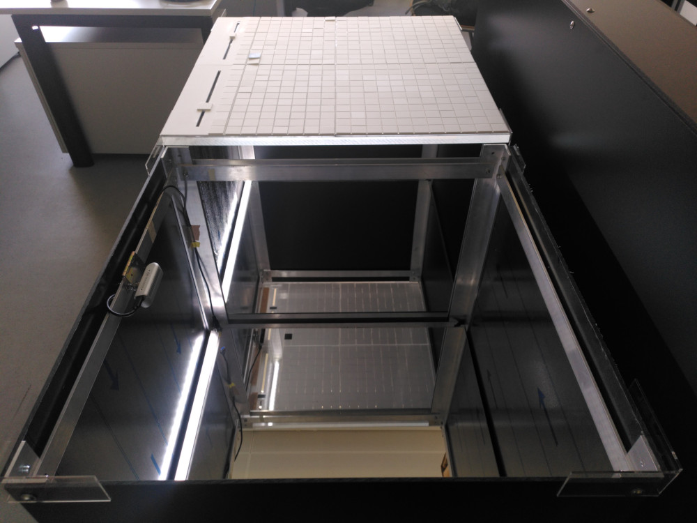
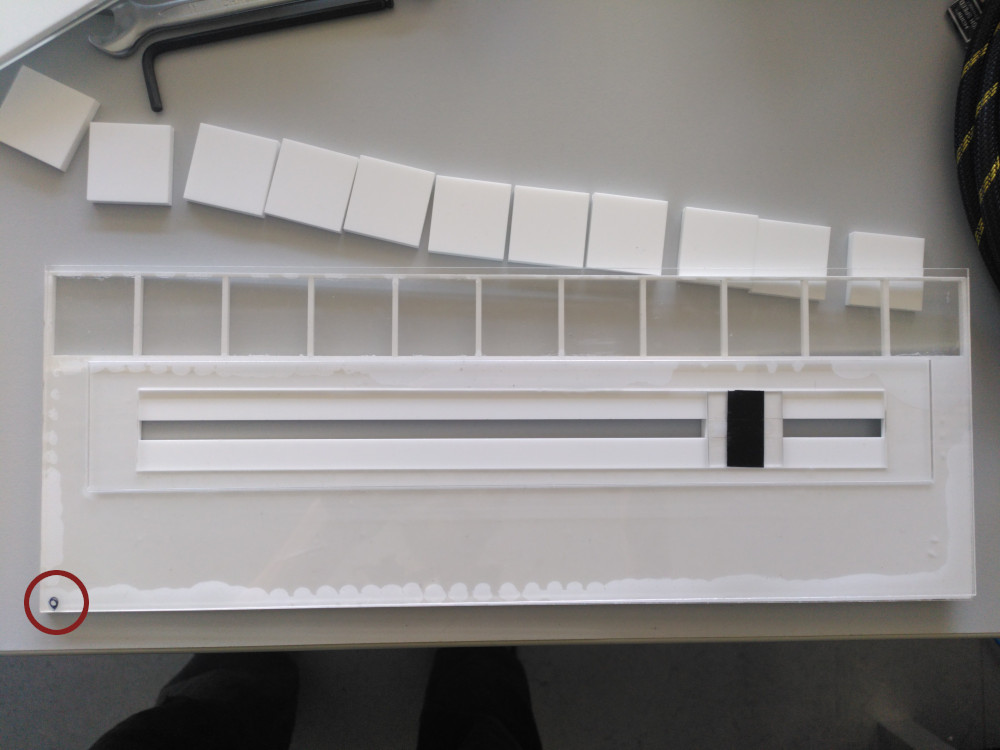

Quick Setup Manual
##################

This manual is meant as a handout and briefly describes the single steps needed to set up the Q-Scope for exhibition.

.. _setup_instructions:

Setup Instructions
******************

**1.** Place the tables in front of the unit with the Infoscreen and projector (fine-tuning will be done later)

**2.** put mirrors into the table, connect the cameras usb cables to the computer.

**3.** there is one led strip inside each of the tables at the side of the webcam.

**4.** make sure the camera captures the whole mirror. You can use the :ref:`realsense-viewer<realsense>` application for this. **Note: make sure the USB 3 connection is established. If only USB type 2 is detected, unplug the cameras and try another time!**

**5.** Put the heavy acrylic glass on top. These have some tape on the bottom side that was used to cover some light reflection. These tapes indicate, whether it is the left or the right table, by showing an 'L' or an 'R', respectively.

**6.** Put the acrylic grid and the sliders on top: The sliders are marked with a little number on the bottom side, since (as of today) they are slightly different and need :ref:`specific positioning relative to the cameras <frontend_slider_setup>`. Numbering goes from left to right (0 to 3)

**7.** now conduct the :ref:`cspy calibration<cspy_calibration>`:

#. (first stop all running programs using ``stop.sh``)
#. go to the cspy folder and ``python3 run_keystone.py``
#. conduct rough keystoning by positioning the corner points roughly in this order: up right, up left, bottom right, bottom left.
#. execute ``python3 run_scanner.py`` and fine-tune the positioning of the corner points using TAB and WASD keys. Press ``k`` to save.
#. Conduct the :ref:`calibration of the detection<cspy_detection_settings>` algorithm according to the light conditions.

.. image:: ../img/cspy_all_windows.png
    :align: center
    :alt: Ideal calibration situation with three windows showing the original RGB webcam stream, the resulting image after brightness and threshold adjustments, and a greyscale overlay to even out uneven light distribution.

In an ideal calibration (like in the image above), the **binary image** should show the tags' black quarters as perfect white squares. No light should leak through the grid.

**8. Projection keystoning:** start the frontend projection via ``cd path/to/frontend && python3 run_q100viz.py``. Enter the keystone-calibration by pressing ``c``, put the viewports corners right on the tables edges, until no light leaks to the floor. Also, enable grid view via ``c`` - if the frontend grid matches the physical grid. Move the physical grid slightly, if needed and possible. Things should line up more or less precisely now.

TODO: how to disassemble & transport
