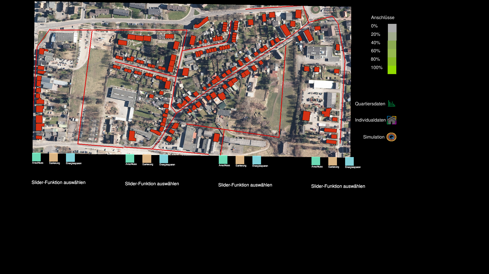

Setup
#####
Setting up the physical table, combining all the necessary components (cspy, infoscreen, frontend)

Hardware Overview
*****************

.. image:: img/CAD_closeUp_annotated.png
    :align: center

The whole setup is made of two physical tables, with interactive components on top; two cameras sitting inside the tables; a projector casting an image onto the tables; and a TV screen to show additional information.
The table tops are of acrylic glass, on top of which there is a grid of tiles. Some of the tiles are tagged on the underside, so they can be decoded by the cameras from below. Each interaction with any of the tagged tiles will cause the projection and the infoscreen to respond in real time.

.. image:: img/Q-Scope_tangibles_tags.jpg
    :align: center
    :alt: Image of four 3D-printed, colored houses with black and white tags on the underside.

In the image above you see four groups of :ref:`tangibles<programming_tangibles>` - objects with the same color (human-readable) share the same tag (machine-readable).

Software Overview
*****************

.. image:: img/Q-Scope_software_components.png
    :align: center
    :alt: Here you should see a schematic overview on the different software components the Q-Scope setup requires: cspy, frontend, infoscreen, abm

Each physical component of the setup has a piece of software it is linked with.
The image stream (camera) of the grid of tiles are scanned and decoded by **cspy**. The software sends the grid information to the **frontend** (projector), which will cast an adjusted interface onto the table accordingly and send information about the machine state to the **infoscreen** (TV) to display metadata. A GAMA Agent-Based-Model (**ABM**) can be executed via interaction on the table. The data it outputs is stored locally and loaded by the infoscreen to display comprehensive graphs.

Framework Architecture
**********************

go to the repositories listed below and download them; I would recommend putting them all into one project folder like so:

.. code-block::

    project qScope
    └───cspy_L
    │   Token Tag Decoder (for left table)
    └───cspy_R
    |   Tag Decoder for the right table
    └───data
    └───q100_abm
    └───qScope_infoscreen
    │   infoscreen (NodeJS/ JavaScript)
    └───qScope_frontend
        projection (Python)

where:

* cspy_L and cspy_R: https://github.com/quarree100/cspy (you'll need this script twice - one for each table)
* data: has to be linked from Seafile server as discussed :ref:`below <Data>`.
* GAMA: https://github.com/quarree100/q100_abm
* qScope_infoscreen: https://github.com/quarree100/qScope_infoscreen
* qScope_frontend: https://github.com/quarree100/qScope_frontend

Go directly to:

* :ref:`Installing the frontend<frontend_installation>`
* :ref:`Installing the decoder<installing_cspy>`
* :ref:`Installing the infoscreen<installing_infoscreen>`
* :ref:`Installing GAMA<installing_gama>`

.. _Data:

Data
****

Q-Scope relies on a local data folder with GIS information on the map, the polygons and data on the houses that shall be displayed. The folder contains Shapefiles used to display both an aerial photograph (raster file) and polygon information for each houses to be able to interact with - provided as Shapefiles. Some additional, household-specific data in the form of csv files are provided, which can be lined to the polygons.

TODO: provide simple working example data folder without sensitive data!

Starting the software
*********************

You'll need Python to start the **frontend**. The frontend will be started by navigating to the  project folder and do ``python3 run_q100viz.py``. A window will open and show the contents that will be projected onto the table. This is the frontend the users can see and interact with:

You see a lot of the black canvas around a slightly distorted map. This is due to the "keystoning", the adjustment of the image for the angles the projector produces with respect to the table. By casting an appropriately distorted image onto the table, the distortion will even out, geometrically. ✨

Now we want to interact with the things we see on the canvas - the buttons, the sliders and the map. For this, we'll need cspy, which serves as the **backend**, decoding the configuration of tangibles on the table.
Start the script for each table individually by navigating to the cspy folders and do ``python3 run_keystone.py``. A window will show up to define the Region of Interest and do the :ref:`keystone calibration<calibrating_the_table>`. After doing this once, the adjustment will be saved and this step can be skipped next time.
The scanning will be started with ``python3 run_scanner.py``. The decoder will send interaction data now to the frontend script, which will react by altering the projection.

In order for the **infoscreen** to receive and process information, it has to be started by executing ``npm start`` or ``node q100_info.js`` in the q100_info folder.

You can start each program individually, but be aware that, for the handshake between the programs to succeed, it is recommended to follow certain order:

.. code-block::

    cd path/to/cspy_L
    python3 run_scanner.py

    cd path/to/cspy_R
    python3 run_scanner.py

    cd path/to/qScope_infoscreen
    node q100_info.js

    cd path/to/qScope_frontend
    python3 run_q100viz.py

We put these commands into a shell script called run_qScope.sh to be executed automatically upon startup of the computer.

.. _calibrating_the_table:

Calibrating the Table:
======================

TODO: process of calibration with images and hotkeys